ok# Building DeepSeek from Scratch - Comprehensive Notes

## Table of Contents

1. [Introduction](#1-introduction)
2. [What is DeepSeek?](#2-what-is-deepseek)
3. [Understanding Large Language Models (LLMs)](#3-understanding-large-language-models-llms)
   - 3.1 [Core Concept: Probabilistic Next Token Prediction](#31-core-concept-probabilistic-next-token-prediction)
   - 3.2 [The "Large" in Large Language Models](#32-the-large-in-large-language-models)
   - 3.3 [Size Scaling Law](#33-size-scaling-law)
   - 3.4 [Emergent Properties](#34-emergent-properties)
   - 3.5 [The Transformer Architecture](#35-the-transformer-architecture)
   - 3.6 [LLM Creation: Two-Stage Process](#36-llm-creation-two-stage-process)
4. [DeepSeek Model Evolution](#4-deepseek-model-evolution)
   - 4.1 [Timeline and Versions](#41-timeline-and-versions)
   - 4.2 [DeepSeek R1: The Breakthrough](#42-deepseek-r1-the-breakthrough)
5. [Comparing DeepSeek with Other AI Models](#5-comparing-deepseek-with-other-ai-models)
   - 5.1 [DeepSeek vs GPT-4](#51-deepseek-vs-gpt-4)
   - 5.2 [DeepSeek vs LLaMA](#52-deepseek-vs-llama)
   - 5.3 [Performance Benchmarks](#53-performance-benchmarks)
   - 5.4 [Cost Analysis](#54-cost-analysis)
   - 5.5 [Strengths and Weaknesses](#55-strengths-and-weaknesses)
6. [What Makes DeepSeek Special?](#6-what-makes-deepseek-special)
   - 6.1 [Innovative Architecture](#61-innovative-architecture)
   - 6.2 [Training Methodology](#62-training-methodology)
   - 6.3 [GPU Optimization Tricks](#63-gpu-optimization-tricks)
   - 6.4 [Model Ecosystem](#64-model-ecosystem)
7. [Why DeepSeek is a Turning Point in AI History](#7-why-deepseek-is-a-turning-point-in-ai-history)
8. [Lecture Series Plan](#8-lecture-series-plan)
9. [Key Takeaways](#9-key-takeaways)
10. [References and Further Reading](#10-references-and-further-reading)

---

## 1. Introduction

**DeepSeek** represents a paradigm shift in the development of Large Language Models (LLMs). This lecture series focuses on understanding and building DeepSeek from scratch, covering:

- What DeepSeek is and its significance
- Technical innovations that make DeepSeek special
- The architecture, training methodology, and optimization techniques
- A structured learning path to master DeepSeek's implementation

---

## 2. What is DeepSeek?

**DeepSeek is a Chinese company specializing in building Large Language Models (LLMs).**

### Key Facts:
- **Origin:** China-based AI company
- **Focus:** Development of state-of-the-art LLMs
- **Notable Achievement:** Created models competitive with GPT-4 at a fraction of the cost
- **Philosophy:** Open-source approach to AI democratization


---

## 3. Understanding Large Language Models (LLMs)

### 3.1 Core Concept: Probabilistic Next Token Prediction

At the heart of every LLM is a **probabilistic engine** that predicts the next token in a sequence.


#### Mathematical Representation

For a given sequence of tokens $x_1, x_2, \ldots, x_t$, the LLM computes:

$$P(x_{t+1} | x_1, x_2, \ldots, x_t)$$

Where:
- $x_t$ = token at position $t$
- $P(x_{t+1} | \cdots)$ = probability of next token given previous tokens

The complete sentence probability is:

$$P(x_1, x_2, \ldots, x_n) = \prod_{t=1}^{n} P(x_t | x_1, x_2, \ldots, x_{t-1})$$

#### Example: Token Prediction

**Input Sentence:** "After years of hard work, your effort will take you"

**Top 10 Token Predictions:**

| Rank | Token | Probability | Log Probability |
|------|-------|-------------|-----------------|
| 1 | **to** | 79.91% | -0.225 |
| 2 | far | 3.80% | -3.271 |
| 3 | places | 2.74% | -3.597 |
| 4 | where | 2.12% | -3.853 |
| 5 | a | 1.38% | -4.283 |
| 6 | higher | 1.25% | -4.381 |
| 7 | on | 0.89% | -4.720 |
| 8 | there | 0.84% | -4.779 |
| 9 | closer | 0.76% | -4.882 |
| 10 | beyond | 0.65% | -5.036 |

**Key Insight:** Although "to" is selected (highest probability), there's still non-zero probability for other tokens. This is the **probabilistic nature** of LLMs.

#### Probability Distribution Characteristics

On a log-log scale, token probabilities typically follow:

$$\log P(token_i) \propto -\alpha \cdot \log(rank_i)$$

Where:
- First token has very high probability (confident predictions)
- Probability decreases rapidly for lower-ranked tokens
- Forms a "long tail" distribution

---

### 3.2 The "Large" in Large Language Models

**No exact definition exists**, but "large" typically refers to models with:
- **Billions of parameters** (> 1B parameters)
- Ability to show **emergent properties**
- Trained on **massive datasets** (hundreds of GBs to TBs)

#### Parameter Scale Comparison

| Model | Parameters | Year | Organization |
|-------|------------|------|--------------|
| GPT-2 | 1.5B | 2019 | OpenAI |
| GPT-3 | 175B | 2020 | OpenAI |
| LLaMA 2 | 70B | 2023 | Meta |
| GPT-4 | ~1.76T (rumored) | 2023 | OpenAI |
| DeepSeek v3 | **671B** | 2024 | DeepSeek |
| DeepSeek R1 | Based on v3 | 2025 | DeepSeek |

---

### 3.3 Size Scaling Law

**Key Principle:** Model performance improves predictably with increased size (parameters and compute).

#### Mathematical Formulation

The scaling law can be expressed as:

$$L(N) = \left(\frac{N_c}{N}\right)^\alpha$$

Where:
- $L(N)$ = Loss as a function of model size
- $N$ = Number of parameters
- $N_c$ = Critical scale parameter
- $\alpha$ = Scaling exponent (typically 0.05-0.10)

#### Exponential Growth in Model Size

From 1950s to 2025:

$$N(t) = N_0 \cdot e^{\lambda t}$$

Where:
- $N(t)$ = Number of parameters at time $t$
- $N_0$ = Initial parameter count
- $\lambda$ = Growth rate constant
- $t$ = Time in years

**Observation from Nature Paper (1950-2020):**
- Exponential increase in neural network parameters
- Orange dots (recent years) = Language models dominating the size space
- Current frontier: ~1 trillion parameters


#### Why Scale Matters: GPT-3 Paper Evidence

**"Language Models are Few-Shot Learners" (GPT-3 Paper):**

Demonstrated that increasing from:
- **1.3B → 13B → 175B parameters**

Results in:
- Dramatic improvement in one-shot learning
- Dramatic improvement in few-shot learning
- Emergence of capabilities not present in smaller models

---

### 3.4 Emergent Properties

**Definition:** Capabilities that appear suddenly at certain model sizes but are absent in smaller models.

#### Characteristics of Emergent Behavior

$$\text{Capability}(N) = \begin{cases} 
0 & \text{if } N < N_{threshold} \\
f(N) & \text{if } N \geq N_{threshold}
\end{cases}$$

Where:
- $N_{threshold}$ = Critical model size for emergence
- $f(N)$ = Performance function above threshold

#### Examples of Emergent Properties

| Task | Emergence Point | Description |
|------|-----------------|-------------|
| **Arithmetic** | ~10²² FLOPs | Ability to perform multi-digit addition/subtraction |
| **Word Unscrambling** | ~10²³ FLOPs | Rearranging scrambled letters to form words |
| **IPA Transliterate** | ~10²³ FLOPs | Converting text to phonetic notation |
| **Persian QA** | ~10²⁴ FLOPs | Answering questions in Persian language |
| **Grounded Mappings** | ~10²³ FLOPs | Mapping abstract concepts to concrete examples |
| **Multi-task NLU** | ~10²⁴ FLOPs | Natural language understanding across tasks |

**Visual Pattern:** Sharp "hockey stick" curves showing sudden capability acquisition

```mermaid
graph LR
    A[Small Models<br/>~1B params] -->|No capability| B[Translation: ❌<br/>Reasoning: ❌<br/>Code: ❌]
    
    C[Medium Models<br/>~10B params] -->|Limited capability| D[Translation: ⚠️<br/>Reasoning: ⚠️<br/>Code: ⚠️]
    
    E[Large Models<br/>100B+ params] -->|Strong capability| F[Translation: ✅<br/>Reasoning: ✅<br/>Code: ✅<br/>Summarization: ✅<br/>Creative Writing: ✅]
    
    style E fill:#90EE90
```



#### Why Emergent Properties Matter

**Companies chase size because:**
1. Hoping for new capabilities beyond current understanding
2. $10^{12}$ parameters (10 trillion) might unlock unforeseen abilities
3. $10^{14}$ parameters (100 trillion) could enable AGI-like properties

---

### 3.5 The Transformer Architecture

**The secret sauce powering modern LLMs**

#### Historical Context

**"Attention is All You Need" (2017)** introduced the Transformer architecture that revolutionized NLP.

#### Key Components


#### Transformer vs Earlier NLP Models

| Aspect | Earlier NLP Models | Transformer-based LLMs |
|--------|-------------------|------------------------|
| **Task Specificity** | Designed for specific tasks (e.g., translation only) | General-purpose (translation, summarization, QA, coding, etc.) |
| **Architecture** | RNNs, LSTMs, Task-specific networks | Universal Transformer architecture |
| **Example Capability** | Cannot write email from custom instructions | Can write emails, code, essays, etc. from instructions |
| **Context Handling** | Limited (sequential processing) | Parallel processing, long-range dependencies |
| **Scaling** | Performance plateaus | Continues improving with scale |

**Critical Difference:**
- **Earlier models:** Could NOT write an email from custom instructions
- **Modern LLMs:** Trivial task

---

### 3.6 LLM Creation: Two-Stage Process


#### Stage 1: Pre-training

**Objective:** Create a foundational model with basic language understanding

**Process:**
1. **Data Collection:**
   - Internet text corpus
   - Books (Project Gutenberg, etc.)
   - Wikipedia articles
   - Research papers (arXiv)
   - Code repositories (GitHub)
   - News articles
   - Reddit posts (for GPT-2)

2. **Training Method:**
   - **Auto-regressive training** (self-supervised)
   - Model creates its own training data
   - No manual labeling required

**Mathematical Framework:**

Given a corpus $\mathcal{D} = \{w_1, w_2, \ldots, w_T\}$:

$$\mathcal{L}_{pretrain} = -\sum_{t=1}^{T} \log P(w_t | w_1, w_2, \ldots, w_{t-1}; \theta)$$

Where:
- $\theta$ = Model parameters
- Goal: Minimize negative log-likelihood

3. **Cost:**
   - Upwards of **millions of dollars**
   - Can reach **tens/hundreds of millions** for largest models

4. **Result:**
   - **Foundational model** with basic language capabilities
   - Can complete sentences but may not follow instructions well

#### GPT-2 Pre-training Data Sources

| Source | Description | Volume |
|--------|-------------|--------|
| WebText | Reddit links with 3+ upvotes | 40GB |
| Books | Books1 and Books2 datasets | 16GB |
| Wikipedia | English Wikipedia | 3GB |
| OpenWebText | Open-source Reddit recreation | 38GB |

#### Stage 2: Fine-tuning

**Objective:** Specialize the model for specific tasks and align with human preferences

**Process:**
1. **Supervised Fine-tuning (SFT):**
   - Use **labeled datasets**
   - Examples:
     - Instruction: "Convert 45 kilometers to meters"
     - Label: "45,000 meters"

2. **Reinforcement Learning from Human Feedback (RLHF):**
   - Human annotators **grade outputs**
   - Feedback passed back to model
   - Model learns to generate preferred responses

**RLHF Mathematical Framework:**

$$\mathcal{L}_{RLHF} = \mathbb{E}_{x \sim \mathcal{D}, y \sim \pi_\theta} [r(x, y)] - \beta \cdot KL(\pi_\theta || \pi_{ref})$$

Where:
- $r(x, y)$ = Reward function (human preference)
- $\pi_\theta$ = Policy (fine-tuned model)
- $\pi_{ref}$ = Reference policy (pre-trained model)
- $\beta$ = KL divergence coefficient
- $KL(\pi_\theta || \pi_{ref})$ = Prevents model from deviating too far from original

3. **Tasks Taught:**
   - Instruction following
   - Translation
   - Summarization
   - Question answering
   - Code generation
   - Safe and helpful responses

#### Fine-tuning Example: Translation

**Dataset Format:**
```
Input: "Translate to Spanish: Hello, how are you?"
Output: "Hola, ¿cómo estás?"

Input: "Translate to French: Good morning"
Output: "Bonjour"
```

**Result:** Model learns translation as a specific capability

#### Fine-tuning Example: GPT-3.5 → ChatGPT

**Process:**
1. GPT-3 (foundational) → GPT-3.5 (instruction-tuned) → ChatGPT (RLHF-tuned)
2. Human annotators rated responses
3. Model trained to maximize high-rated response likelihood

**Impact of RLHF:**
- Better instruction following
- More helpful and harmless responses
- Reduced hallucinations
- Appropriate tone and style

---

## 4. DeepSeek Model Evolution

### 4.1 Timeline and Versions


#### Detailed Version Breakdown

| Version | Release Date | Parameters | Type | Key Feature |
|---------|--------------|------------|------|-------------|
| **DeepSeek LLM v1** | 2023 Q2 | ~7B-67B | Base | Initial foundation |
| **DeepSeek Math** | 2023 Q3 | 7B | Specialized | Mathematical reasoning |
| **DeepSeek Coder** | 2023 Q4 | 6.7B-33B | Specialized | Code generation |
| **DeepSeek v2** | 2024 Q1 | 236B | Base | MoE architecture |
| **DeepSeek v2 Coder** | 2024 Q3 | 236B | Specialized | Enhanced coding |
| **DeepSeek v3** | 2024 Q4 | **671B** | Base | Flagship foundation model |
| **DeepSeek R1** | 2025 Q1 | Based on v3 | **Reasoning** | **RLHF-driven reasoning** |

#### Technical Papers Published

1. **DeepSeek v2:** 52-page technical report
2. **DeepSeek v3:** 53-page technical report
3. **DeepSeek R1:** Comprehensive paper on reasoning model

**Access:** All papers available at [deepseek.com](https://www.deepseek.com) under Research section

---

### 4.2 DeepSeek R1: The Breakthrough

**Released:** January 2025

#### What Makes R1 Special?


#### Key Achievements

| Aspect | DeepSeek R1 | OpenAI o1 | Winner |
|--------|-------------|-----------|--------|
| **Performance** | Comparable | State-of-art | Tie |
| **Cost (per M tokens)** | $0.55 | $30 | **DeepSeek** |
| **Open Source** | ✅ Yes | ❌ No | **DeepSeek** |
| **Reasoning Quality** | Excellent | Excellent | Tie |
| **Training Cost** | Low (relative) | Very High | **DeepSeek** |
| **Accessibility** | High | API only | **DeepSeek** |

#### Example: Mathematical Reasoning

**Problem:** 
$$\int_0^1 \frac{x^4(1-x)^4}{1+x^2} dx$$

**Challenge:** Show that the result equals $\frac{22}{7} - \pi$

**DeepSeek R1 Performance:**
- ✅ Solved correctly step-by-step
- ✅ Provided detailed reasoning
- ✅ Time: 10-15 seconds

**GPT-4o Performance:**
- ❌ Selected wrong answer (option B: 2/105)
- ❌ Failed to reason correctly

**Historical Context:**
- Problem from **1968 Putnam Competition**
- Proof first devised in **1944**
- Demonstrates: $\frac{22}{7} > \pi$ (common misconception that 22/7 = π)

---

## 5. Comparing DeepSeek with Other AI Models

### 5.1 DeepSeek vs GPT-4

#### Comprehensive Comparison Table

| Dimension | DeepSeek v3/R1 | GPT-4/GPT-4o | Analysis |
|-----------|----------------|--------------|----------|
| **Performance** | Similar/Superior on many tasks | State-of-art | Context-dependent, often comparable |
| **Cost (API)** | **$0.55/M tokens** | **$30/M tokens** | **DeepSeek 54x cheaper** |
| **Open Source** | ✅ Full weights available | ❌ Closed, API-only | Major advantage for DeepSeek |
| **Training Cost** | Low (millions) | Very high (100s of millions) | Democratizes AI development |
| **Local Deployment** | ✅ Possible (with resources) | ❌ Not possible | Privacy & control advantage |
| **Safety & Polish** | ⚠️ Less refined | ✅ Heavily refined | GPT-4 more production-ready |
| **Community Support** | 🔥 Rapidly growing | Established | Both strong |
| **Parameters** | 671B | ~1.76T (rumored) | Both in similar tier |

#### Performance Benchmark Comparison

**Evaluation Score vs Pricing:**


**DeepSeek Position:** Top-right corner (high performance, low cost) = **Optimal**

#### Specific Benchmark Results

| Benchmark | DeepSeek v3 | GPT-4 | Winner |
|-----------|-------------|-------|--------|
| MMLU (Multi-task) | 88.5% | 86.4% | **DeepSeek** |
| GSM8K (Math) | 90.2% | 92.0% | GPT-4 |
| HumanEval (Code) | 85.7% | 86.3% | Close |
| BBH (Reasoning) | 89.1% | 87.5% | **DeepSeek** |
| TruthfulQA | 82.3% | 85.8% | GPT-4 |

**Takeaway:** DeepSeek outperforms or matches GPT-4 on **most** benchmarks while being **vastly cheaper**

---

### 5.2 DeepSeek vs LLaMA

**LLaMA:** Open-source models from Meta (Facebook)
- LLaMA 2: up to 70B parameters
- LLaMA 3: up to 405B parameters

#### Comparison Table

| Aspect | DeepSeek v3 | LLaMA 3 (405B) | DeepSeek Advantage |
|--------|-------------|----------------|-------------------|
| **Parameters** | **671B** | 405B | ✅ 66% more parameters |
| **Architecture** | MoE + MLA + MTP | Dense Transformer | ✅ More innovations |
| **Performance** | Superior | Strong | ✅ Better on most benchmarks |
| **Training Efficiency** | High (RL, distillation) | Standard | ✅ More efficient training |
| **Cost to Use** | Very Low | Free (but hosting cost) | Both open-source |
| **Open Source** | ✅ | ✅ | Both excellent |

#### Benchmark Comparison

| Task | DeepSeek v3 | LLaMA 3 405B | LLaMA 2 70B |
|------|-------------|--------------|-------------|
| MMLU | 88.5% | 85.2% | 68.9% |
| Math (GSM8K) | 90.2% | 89.0% | 56.8% |
| Code (HumanEval) | 85.7% | 84.2% | 48.1% |
| Reasoning (BBH) | 89.1% | 86.5% | 67.3% |


#### Why DeepSeek Outperforms LLaMA

**Key Innovations in DeepSeek:**

1. **Mixture of Experts (MoE):**
   - Activates only subset of parameters per token
   - LLaMA uses dense activation (all parameters)

2. **Multi-Head Latent Attention (MLA):**
   - Efficient attention mechanism
   - Reduced memory footprint

3. **Multi-Token Prediction (MTP):**
   - Predicts multiple future tokens
   - Faster inference, better training

4. **Advanced Quantization:**
   - FP8 quantization in forward pass
   - Maintains quality with less memory

5. **Reinforcement Learning Training:**
   - Sophisticated RL for reasoning
   - Group Relative Policy Optimization (GRPO)

---

### 5.3 Performance Benchmarks

#### DeepSeek Website Benchmark Comparison

When visiting [deepseek.com](https://www.deepseek.com) and examining the parameters section:

| Benchmark | DeepSeek v3 | GPT-4 | Claude 3.5 | Gemini Ultra |
|-----------|-------------|-------|------------|--------------|
| Overall Score | **92.3** | 91.8 | 91.2 | 90.7 |
| Math Reasoning | **94.1** | 92.5 | 91.8 | 93.2 |
| Code Generation | **91.7** | 92.3 | 90.5 | 89.8 |
| Language Understanding | **93.8** | 92.1 | 93.2 | 91.6 |
| Common Sense | **90.5** | 91.2 | 92.8 | 90.9 |

**Conclusion:** DeepSeek v3 **outperforms or matches** GPT-4 on **almost all** benchmarks

---

### 5.4 Cost Analysis

#### Detailed Cost Breakdown

**API Pricing Comparison (per million tokens):**

| Model | Input Cost | Output Cost | Avg Cost | Relative Cost |
|-------|-----------|-------------|----------|---------------|
| **DeepSeek v3/R1** | $0.27 | $1.10 | **$0.55** | **1x (baseline)** |
| GPT-4 Turbo | $10.00 | $30.00 | $20.00 | 36x more expensive |
| GPT-4o | $5.00 | $15.00 | $10.00 | 18x more expensive |
| GPT-4o-mini | $0.15 | $0.60 | $0.30 | 0.55x (cheaper) |
| Claude 3.5 Sonnet | $3.00 | $15.00 | $9.00 | 16x more expensive |
| Gemini Pro | $1.25 | $5.00 | $3.13 | 6x more expensive |

**Visual Representation:**


#### Cost Efficiency Example

**Scenario:** Processing 100 million tokens per month

| Model | Monthly Cost | Annual Cost |
|-------|--------------|-------------|
| DeepSeek R1 | $55 | $660 |
| GPT-4o | $1,000 | $12,000 |
| GPT-4 Turbo | $2,000 | $24,000 |

**Savings with DeepSeek:**
- vs GPT-4o: **$11,340/year (94.5% savings)**
- vs GPT-4 Turbo: **$23,340/year (97.3% savings)**

---

### 5.5 Strengths and Weaknesses

#### DeepSeek Strengths


**Top 3 Strengths:**
1. 🏆 **Cost Efficiency:** 50-100x cheaper than GPT-4
2. 🔓 **Open Source:** Full transparency and control
3. 🚀 **Performance:** Competitive with best closed models

#### DeepSeek Weaknesses


**Top 3 Weaknesses:**
1. ⚠️ **Less Polished:** Not as refined as GPT-4 for production
2. 🖥️ **Resource Intensive:** 671B params requires serious hardware
3. 🔧 **Immature Ecosystem:** Fewer tools/plugins compared to OpenAI

#### Decision Matrix: When to Use Which Model

| Use Case | Recommended Model | Reasoning |
|----------|------------------|-----------|
| **Enterprise production** (safety critical) | GPT-4 | More polished, better safety |
| **Cost-sensitive startup** | **DeepSeek** | 50x cost savings, good performance |
| **Research & experimentation** | **DeepSeek** | Open weights, full control |
| **Privacy-critical applications** | **DeepSeek** | Can self-host |
| **Quick prototyping** (no infra) | GPT-4o-mini or DeepSeek API | Easy access, low friction |
| **On-premise deployment** | **DeepSeek** | Open source enables it |
| **Highly regulated industry** | GPT-4 (for now) | More compliance documentation |

---

## 6. What Makes DeepSeek Special?

### Overview of Four Pillars


---

### 6.1 Innovative Architecture

DeepSeek implements **five key architectural innovations** that dramatically improve efficiency and performance.

#### 6.1.1 Multi-Head Latent Attention (MLA)

**Problem with Standard Multi-Head Attention:**

In the original Transformer ("Attention is All You Need"), the multi-head attention mechanism requires storing:

$$\text{KV Cache Size} = 2 \times n_{layers} \times n_{heads} \times d_{head} \times L$$

Where:
- $n_{layers}$ = number of layers
- $n_{heads}$ = number of attention heads
- $d_{head}$ = dimension per head
- $L$ = sequence length

**For a 671B parameter model with standard attention:**
- Cache size can be **100+ GB** for long sequences
- Memory bottleneck during inference

**DeepSeek Solution: Multi-Head Latent Attention**

Instead of storing full key-value pairs, compress them into a **latent space**:

$$K_{latent} = W_k \cdot K_{full}$$
$$V_{latent} = W_v \cdot V_{full}$$

Where:
- $K_{full} \in \mathbb{R}^{n_{heads} \times d_{head}}$ (original)
- $K_{latent} \in \mathbb{R}^{d_{latent}}$ where $d_{latent} \ll n_{heads} \times d_{head}$

**Memory Savings:**

$$\text{Reduction Factor} = \frac{n_{heads} \times d_{head}}{d_{latent}} \approx 4\text{-}8\times$$

**Visual Comparison:**


**Benefits:**
- ✅ **4-8x memory reduction** in KV cache
- ✅ Faster inference (less memory bandwidth)
- ✅ Longer context windows possible
- ✅ Maintains quality (minimal performance drop)

---

#### 6.1.2 Mixture of Experts (MoE)

**Core Idea:** Instead of activating the entire neural network for every token, only activate a **subset of "experts"** per token.

**Standard Dense Model:**


**All parameters activated:** Computationally expensive

**Mixture of Experts Model:**


**Only 1-2 experts activated per token:** Computationally efficient

#### Mathematical Formulation

For input $x$, the MoE layer computes:

$$\text{MoE}(x) = \sum_{i=1}^{N} G(x)_i \cdot E_i(x)$$

Where:
- $G(x) = \text{Softmax}(\text{TopK}(W_g \cdot x, k))$ = Gating function
- $E_i(x)$ = Output of expert $i$
- $N$ = Total number of experts
- $k$ = Number of experts to activate (typically 2)

**TopK Gating:**

$$G(x)_i = \begin{cases}
\frac{e^{(W_g \cdot x)_i}}{\sum_{j \in \text{TopK}} e^{(W_g \cdot x)_j}} & \text{if } i \in \text{TopK} \\
0 & \text{otherwise}
\end{cases}$$

#### DeepSeek MoE Architecture

**Specifications:**
- **Total Parameters:** 671B
- **Active Parameters per Token:** ~37B
- **Number of Experts:** 256
- **Experts per Token:** 8 (Top-8 routing)
- **Shared Parameters:** Yes (some layers shared)

**Efficiency Gain:**

$$\text{Computation Reduction} = \frac{\text{Dense Model FLOPs}}{\text{MoE Active FLOPs}} = \frac{671B}{37B} \approx 18\times$$

**Load Balancing:**

To prevent all tokens routing to the same experts:

$$\mathcal{L}_{balance} = \alpha \cdot \text{Var}(\text{Expert Load})$$

Added to training loss to encourage balanced expert utilization.

**Benefits:**
- ✅ **18x computational efficiency** during inference
- ✅ **671B capacity** with **37B active compute**
- ✅ Specialists emerge (e.g., math expert, code expert)
- ✅ Scalable to trillion+ parameters

---

#### 6.1.3 Multi-Token Prediction (MTP)

**Standard LLM Training:** Predict only the **next** token

$$\mathcal{L}_{standard} = -\log P(x_{t+1} | x_1, \ldots, x_t)$$

**DeepSeek Innovation:** Predict **multiple future tokens**

$$\mathcal{L}_{MTP} = -\sum_{i=1}^{n} \log P(x_{t+i} | x_1, \ldots, x_t)$$

Where $n$ = number of future tokens (typically 4-8)

**Visual Representation:**


#### Implementation Architecture

**Multi-Head Prediction:**


**Total Loss:**

$$\mathcal{L}_{total} = \sum_{i=1}^{n} \lambda_i \cdot \mathcal{L}_i$$

Where:
- $\lambda_i$ = Weight for position $i$ (typically decreasing: $\lambda_1 > \lambda_2 > \cdots$)

**Benefits:**
- ✅ **Better sequence understanding** (looks ahead)
- ✅ **Faster inference** (can generate multiple tokens in parallel)
- ✅ **Improved training efficiency** (more supervision per step)
- ✅ **Better long-range dependencies**

**Paper Reference:** "Better & Faster Large Language Models via Multi-token Prediction" (Meta, 2024)

---

#### 6.1.4 Quantization

**Problem:** Storing 671B parameters in FP32 (32-bit floating point) requires:

$$\text{Memory} = 671 \times 10^9 \times 4 \text{ bytes} = 2,684 \text{ GB} \approx 2.7 \text{ TB}$$

**Solution:** Reduce precision while maintaining quality

#### Quantization Process

**Original (FP32):**
- 1 sign bit
- 8 exponent bits
- 23 mantissa bits
- Range: ~$10^{-38}$ to $10^{38}$

**DeepSeek FP8:**
- 1 sign bit
- 4-5 exponent bits
- 2-3 mantissa bits
- Range: Reduced but sufficient

**Memory Reduction:**

$$\text{Reduction Factor} = \frac{32}{8} = 4\times$$

**Storage for DeepSeek v3 in FP8:**

$$\text{Memory} = 671 \times 10^9 \times 1 \text{ byte} = 671 \text{ GB}$$

**Visual Analogy:**


Just like pixelated images look similar when zoomed out, quantized models perform similarly in practice.

#### DeepSeek Quantization Strategy

**Forward Pass:** FP8 (for speed)
**Backward Pass:** FP16/FP32 (for precision in gradients)

$$\text{Forward: } y = \text{Quantize}(W) \cdot \text{Quantize}(x)$$
$$\text{Backward: } \frac{\partial L}{\partial W} \text{ computed in FP16}$$

**Benefits:**
- ✅ **4x memory reduction**
- ✅ **Faster inference** (FP8 ops are faster)
- ✅ **Minimal accuracy loss** (<1% degradation)
- ✅ **Enables larger batch sizes**

---

#### 6.1.5 Rotary Positional Encodings (RoPE)

**Problem in Original Transformers (2017):**

Positional information was **added** to token embeddings:

$$\text{Input} = \text{Token Embedding} + \text{Positional Encoding}$$

This "pollutes" the semantic meaning of the token embedding.

**Evolution of Positional Encodings:**

```mermaid
graph TB
    A[Positional Encoding Evolution] --> B[Absolute<br/>Sinusoidal<br/>2017]
    B --> C[Learned<br/>Absolute<br/>2018-2019]
    C --> D[Relative<br/>Transformer-XL<br/>2019]
    D --> E[Rotary<br/>RoPE<br/>2021]
    
    style E fill:#90EE90
```

#### RoPE Mathematical Foundation

**Key Idea:** Instead of adding position to embeddings, **rotate** query and key vectors to encode position.

**For query vector $q$ and key vector $k$ at positions $m$ and $n$:**

$$q_m = R(\theta, m) \cdot q$$
$$k_n = R(\theta, n) \cdot k$$

Where $R(\theta, m)$ is a rotation matrix:

$$R(\theta, m) = \begin{pmatrix}
\cos(m\theta) & -\sin(m\theta) \\
\sin(m\theta) & \cos(m\theta)
\end{pmatrix}$$

**Attention Score:**

$$\text{Attention}(q_m, k_n) = q_m^T k_n = (R(\theta,m) \cdot q)^T (R(\theta,n) \cdot k)$$

Using rotation properties:

$$= q^T \cdot R^T(\theta,m) \cdot R(\theta,n) \cdot k = q^T \cdot R(\theta, n-m) \cdot k$$

**Key Insight:** Attention depends only on **relative position** $(n-m)$, not absolute positions $m$ and $n$.

#### Visual Representation

```mermaid
graph TB
    subgraph Old["Additive Positional Encoding"]
        A1[Token Embed] --> C1[Add Position]
        B1[Position Embed] --> C1
        C1 --> D1[Polluted Vector]
    end
    
    subgraph New["Rotary Positional Encoding (RoPE)"]
        A2[Token Embed] --> C2[Query]
        A2 --> D2[Key]
        C2 --> E2[Rotate by position m]
        D2 --> F2[Rotate by position n]
        E2 & F2 --> G2[Attention Score<br/>Encodes relative position]
    end
    
    style New fill:#E6F9E6
```

#### RoPE in Higher Dimensions

For $d$-dimensional vectors, apply rotation to pairs of dimensions:

$$\begin{pmatrix}
q_0 \\ q_1 \\ q_2 \\ q_3 \\ \vdots \\ q_{d-1}
\end{pmatrix} \rightarrow 
\begin{pmatrix}
\cos(m\theta_0) q_0 - \sin(m\theta_0) q_1 \\
\sin(m\theta_0) q_0 + \cos(m\theta_0) q_1 \\
\cos(m\theta_1) q_2 - \sin(m\theta_1) q_3 \\
\sin(m\theta_1) q_2 + \cos(m\theta_1) q_3 \\
\vdots \\
\cos(m\theta_{d/2-1}) q_{d-2} - \sin(m\theta_{d/2-1}) q_{d-1}
\end{pmatrix}$$

Where:
$$\theta_i = 10000^{-2i/d} \quad \text{for } i = 0, 1, \ldots, \frac{d}{2}-1$$

**Benefits:**
- ✅ **No pollution** of token embeddings
- ✅ **Efficient:** Only rotation operations (no addition)
- ✅ **Better extrapolation** to longer sequences
- ✅ **Relative position encoding** naturally captured
- ✅ **Magnitude preserved:** $||R(\theta,m) \cdot q|| = ||q||$

---

### 6.2 Training Methodology

DeepSeek's training methodology is centered on **advanced reinforcement learning**, moving beyond simple supervised learning.

```mermaid
graph TB
    A[Training Methodology] --> B[Large-Scale<br/>Reinforcement Learning]
    A --> C[Rule-Based<br/>Reward System]
    A --> D[Group Relative<br/>Policy Optimization]
    
    B --> E[Advantages]
    C --> E
    D --> E
    
    E --> F[No human labels needed]
    E --> G[Scalable]
    E --> H[Teaches reasoning]
    E --> I[Cost effective]
    
    style A fill:#FFD700
    style E fill:#90EE90
```

#### 6.2.1 The Problem with Traditional Fine-tuning

**GPT-3.5 → ChatGPT Approach:**
1. Collect human demonstrations
2. Train reward model on human preferences
3. Use PPO (Proximal Policy Optimization) with human feedback

**Limitations:**
- 💰 **Expensive:** Requires thousands of human annotators
- 🐌 **Slow:** Human annotation is bottleneck
- 📊 **Limited Scale:** Cannot generate millions of training examples
- 🎯 **Subjective:** Human preferences can be inconsistent

#### 6.2.2 DeepSeek's Rule-Based Reward System

Instead of humans, use **automatic rule-based verification**:

```mermaid
graph TB
    A[Model Generates<br/>Reasoning Chain] --> B{Check Rules}
    B -->|Math Problem| C[Verify Final Answer]
    B -->|Code| D[Run Unit Tests]
    B -->|Logic| E[Check Proof Steps]
    
    C & D & E --> F[Assign Reward]
    F -->|Correct| G[+1 Reward]
    F -->|Incorrect| H[-1 Reward]
    
    G & H --> I[Update Model<br/>via RL]
    
    style I fill:#90EE90
```

**Example: Math Problem**

**Question:** Solve $\int_0^1 \frac{x^4(1-x)^4}{1+x^2} dx$

**Model Generates:**
1. Step 1: Expand numerator... (reasoning)
2. Step 2: Polynomial long division... (reasoning)
3. Step 3: Integrate term by term... (reasoning)
4. **Final Answer:** $\frac{22}{7} - \pi$

**Rule-Based Verification:**
- Compute numerical integral: $\approx 0.001348...$
- Compute $\frac{22}{7} - \pi \approx 0.001264...$
- **Close match** → ✅ **Reward = +1**

**No human needed!**

#### 6.2.3 Group Relative Policy Optimization (GRPO)

**Standard RL Problem:**

$$\mathcal{L}_{RL} = \mathbb{E}_{\pi_\theta}[r(s, a)] - \beta \cdot KL(\pi_\theta || \pi_{ref})$$

**Challenge:** High variance in policy gradient estimates

**GRPO Innovation:**

Instead of absolute rewards, use **relative rewards within a group**:

$$\text{Advantage}(a_i) = r(a_i) - \frac{1}{G}\sum_{j=1}^{G} r(a_j)$$

Where:
- $G$ = Group size (e.g., 8 responses to same question)
- $r(a_i)$ = Reward for response $i$
- Advantage measures how much better $a_i$ is than average

**GRPO Loss:**

$$\mathcal{L}_{GRPO} = -\sum_{i=1}^{G} \text{Advantage}(a_i) \cdot \log \pi_\theta(a_i | s)$$

**Visual Example:**

```mermaid
graph TB
    A[Question: What is 2+2?] --> B[Generate 8 Responses]
    B --> C[Response 1: 4 ✅<br/>Reward: +1]
    B --> D[Response 2: 5 ❌<br/>Reward: -1]
    B --> E[Response 3: 4 ✅<br/>Reward: +1]
    B --> F[... 5 more responses]
    
    C & D & E & F --> G[Compute Group Average<br/>Avg Reward = +0.5]
    
    G --> H[Response 1 Advantage: +0.5]
    G --> I[Response 2 Advantage: -1.5]
    
    H & I --> J[Update Model<br/>Favor Response 1<br/>Discourage Response 2]
```

**Benefits:**
- ✅ **Reduced variance** (comparing within group)
- ✅ **More stable training**
- ✅ **Faster convergence**
- ✅ **Better performance** on reasoning tasks

#### 6.2.4 Why This Enables Reasoning

**Chain of Thought Emergence:**

With RL + rule-based rewards, the model learns:
1. **Break down problems** into steps
2. **Show work** (reasoning chain)
3. **Self-verify** intermediate steps
4. **Correct errors** mid-reasoning

**Example: Model Learns to Reason**

**Early Training (poor):**
```
Q: What is 25 * 37?
A: 925
[Wrong! Reward: -1]
```

**After GRPO Training (excellent):**
```
Q: What is 25 * 37?
A: Let me break this down:
   25 * 37 = 25 * (30 + 7)
           = 25 * 30 + 25 * 7
           = 750 + 175
           = 925
[Correct! Reward: +1]
```

The model learns that **showing reasoning** leads to **higher accuracy**, which leads to **higher rewards**.

---

### 6.3 GPU Optimization Tricks

#### 6.3.1 PTX Instead of CUDA

**Standard Approach: CUDA**
- High-level GPU programming
- Abstracts away hardware details
- Easy to use but not maximally efficient

**DeepSeek Approach: PTX (Parallel Thread Execution)**
- Lower-level than CUDA
- Closer to GPU assembly
- More control over hardware

**Analogy:**

| Level | Programming | Speed | Ease |
|-------|------------|-------|------|
| **High** | Python | Slow | Easy |
| **Mid-High** | Java | Medium | Moderate |
| **Mid** | CUDA | Fast | Complex |
| **Low** | **PTX** | **Fastest** | Very Complex |
| **Lowest** | Machine Code | Fastest | Extremely Hard |

```mermaid
graph TB
    A[High-Level Code<br/>Python, Java] --> B[CUDA<br/>GPU Code]
    B --> C[PTX<br/>Assembly-like]
    C --> D[Machine Code<br/>Binary]
    
    E[DeepSeek<br/>Optimization] -.->|Bypasses CUDA| C
    
    style C fill:#90EE90
```

#### Benefits of PTX

$$\text{Speedup}_{\text{PTX vs CUDA}} \approx 1.2\text{-}1.5\times$$

**Why faster:**
- Direct control over memory access patterns
- Custom instruction scheduling
- Optimized register usage
- Reduced overhead

**Trade-off:**
- ⚠️ Much harder to program
- ⚠️ Less portable across GPU architectures
- ✅ But worth it for large-scale production

---

### 6.4 Model Ecosystem

DeepSeek doesn't just build one giant model—they create an **ecosystem of models** through distillation.

```mermaid
graph TB
    A[DeepSeek v3<br/>671B params<br/>Teacher Model] --> B[Distillation Process]
    
    B --> C[DeepSeek 67B<br/>~10x smaller]
    B --> D[DeepSeek 33B<br/>~20x smaller]
    B --> E[DeepSeek 7B<br/>~100x smaller]
    B --> F[DeepSeek 1.5B<br/>~450x smaller]
    
    style A fill:#FFD700
    style C fill:#90EE90
    style D fill:#87CEEB
    style E fill:#DDA0DD
    style F fill:#FFB6C1
```

#### 6.4.1 Knowledge Distillation Process

**Objective:** Train smaller "student" model to mimic larger "teacher" model

**Mathematical Framework:**

$$\mathcal{L}_{distill} = \alpha \cdot \mathcal{L}_{CE}(y, \hat{y}_{student}) + (1-\alpha) \cdot \mathcal{L}_{KL}(P_{teacher}, P_{student})$$

Where:
- $\mathcal{L}_{CE}$ = Cross-entropy loss (ground truth)
- $\mathcal{L}_{KL}$ = KL divergence loss (soft targets from teacher)
- $\alpha$ = Balancing parameter (typically 0.3-0.5)

**Soft Targets (Temperature Scaling):**

$$P_i = \frac{\exp(z_i / T)}{\sum_j \exp(z_j / T)}$$

Where:
- $z_i$ = Logit for class $i$
- $T$ = Temperature (usually $T > 1$ for distillation)

Higher temperature → Softer probability distribution → More information transfer

#### 6.4.2 Model Size vs Performance Trade-off

| Model Size | Parameters | Performance (% of v3) | Speed (tokens/sec) | Use Case |
|------------|------------|----------------------|-------------------|----------|
| **DeepSeek v3** | 671B | 100% (baseline) | 20 | Maximum quality |
| **DeepSeek 67B** | 67B | 95% | 100 | Production servers |
| **DeepSeek 33B** | 33B | 90% | 180 | Edge servers |
| **DeepSeek 7B** | 7B | 80% | 500 | Mobile, embedded |
| **DeepSeek 1.5B** | 1.5B | 70% | 1000+ | On-device |

**Key Insight:** 70% performance at 450x smaller size is **incredibly valuable** for deployment!

#### 6.4.3 Use Case Matching

```mermaid
graph TB
    A[User Query] --> B{Required Quality?}
    B -->|Max| C[DeepSeek v3 671B]
    B -->|High| D[DeepSeek 67B]
    B -->|Good| E[DeepSeek 7B]
    B -->|Acceptable| F[DeepSeek 1.5B]
    
    G[Latency Requirement?] --> H{Response Time}
    H -->|Can wait| C
    H -->|Sub-second| E
    H -->|Real-time| F
    
    I[Deployment?] --> J{Environment}
    J -->|Cloud| C
    J -->|Server| D
    J -->|Edge| E
    J -->|Mobile| F
    
    style C fill:#FFB6C1
    style F fill:#90EE90
```

---

## 7. Why DeepSeek is a Turning Point in AI History

### 7.1 Democratization of AI

```mermaid
mindmap
  root((DeepSeek<br/>Impact))
    Breaking Barriers
      Small company matches tech giants
      Proof that innovation > resources
      Open source competitive model
    Economic Disruption
      54x cost reduction
      US tech stocks dipped
      Questions AI profit models
    Geopolitical Shift
      Chinese AI at parity with US
      Supply chain concerns
      GPU market questions
    Developing Countries
      India launching LLM initiatives
      Other nations following
      No longer US monopoly
```

#### 7.2 Key Historical Milestones

| Date | Event | Significance |
|------|-------|--------------|
| **2017** | "Attention is All You Need" | Transformer architecture born |
| **2018-2019** | BERT, GPT-2 | Pre-training + fine-tuning established |
| **2020** | GPT-3 (175B) | Size scaling law validated |
| **2022** | ChatGPT | LLMs go mainstream |
| **2023** | GPT-4, PaLM 2, Claude | Closed-source giants dominate |
| **2023-2024** | LLaMA 2/3 | Open-source challenger emerges |
| **2025 Jan** | **DeepSeek R1** | **Open model matches closed, 50x cheaper** |

**DeepSeek R1 = Inflection Point:**
- First time: **Open ≈ Closed** in quality
- First time: **Cost dramatically reduced** (50x)
- First time: **Non-US lab** at frontier

### 7.3 Market Impact

**January 2025: US Tech Stock Dip**

| Company | Stock Drop (Week of Jan 20-27) |
|---------|-------------------------------|
| NVIDIA | -8.5% |
| Microsoft | -5.2% |
| Google | -4.8% |
| Meta | -3.1% |

**Reasons:**
1. **Threat to AI Monopoly:** If China can do it cheaply, so can others
2. **GPU Demand Concerns:** If efficient models need fewer GPUs, NVIDIA sales threatened
3. **API Business Model:** OpenAI's pricing power questioned
4. **Supply Chain:** US advantage in AI chips less critical

### 7.4 Developing Countries' Response

**India's Initiative (Feb 2025):**
- Announced ₹10,000 crore (~$1.2B) investment in foundational models
- Target: Build "India GPT" at DeepSeek-like costs
- Goal: AI sovereignty, not dependence on US/China

**Other Countries Following:**
- Brazil considering national LLM
- UAE expanding AI investments
- South Korea launching LLM consortium

**Key Insight:** DeepSeek proved you **don't need** trillion-dollar budgets to build frontier AI.

### 7.5 Long-term Implications

```mermaid
graph TB
    A[DeepSeek's Proof Point] --> B[More Open Models]
    A --> C[Lower AI Costs]
    A --> D[Geographic Diversification]
    A --> E[Innovation Over Capital]
    
    B --> F[Accelerated Research]
    C --> F
    D --> F
    E --> F
    
    F --> G[AI Benefits<br/>More Accessible]
    
    style G fill:#FFD700
```

---

## 8. Lecture Series Plan

### Phase Structure

```mermaid
graph TB
    A[Building DeepSeek from Scratch] --> B[Phase 1:<br/>Architecture<br/>~50% of content]
    A --> C[Phase 2:<br/>Training Methodology<br/>~30% of content]
    A --> D[Phase 3:<br/>GPU Optimization<br/>~10% of content]
    A --> E[Phase 4:<br/>Model Ecosystem<br/>~10% of content]
    
    style B fill:#87CEEB
    style C fill:#90EE90
    style D fill:#FFB6C1
    style E fill:#DDA0DD
```

---

### Phase 1: Innovative Architecture (Lectures 2-10)

| Lecture | Topic | Duration | Prerequisites |
|---------|-------|----------|---------------|
| **2** | Attention Mechanism Refresher | 2 hrs | Basic ML knowledge |
| **3** | Multi-Head Attention Deep Dive | 2 hrs | Lecture 2 |
| **4** | Multi-Head Latent Attention (MLA) | 3 hrs | Lecture 3 |
| **5** | Mixture of Experts (MoE) - Part 1 | 2.5 hrs | Lecture 3 |
| **6** | Mixture of Experts (MoE) - Part 2 | 2.5 hrs | Lecture 5 |
| **7** | Multi-Token Prediction (MTP) | 2 hrs | Lecture 3 |
| **8** | Quantization Techniques | 2 hrs | Basic linear algebra |
| **9** | Rotary Positional Encodings (RoPE) | 2.5 hrs | Lecture 3 |
| **10** | Complete Architecture Integration | 3 hrs | Lectures 2-9 |

**Detailed Coverage:**

#### Lecture 4: Multi-Head Latent Attention (MLA)
- Original multi-head attention limitations
- Latent space projection theory
- Compression ratio analysis
- Implementation from scratch
- Memory benchmarking

#### Lecture 5-6: Mixture of Experts (MoE)
- Dense vs sparse models
- Gating mechanisms
- Load balancing strategies
- Routing algorithms
- Training stability techniques
- Expert specialization analysis

#### Lecture 7: Multi-Token Prediction (MTP)
- Next-token vs multi-token objectives
- Loss function design
- Prediction head architecture
- Training efficiency gains
- Inference speedup analysis

#### Lecture 8: Quantization
- FP32 → FP16 → FP8 → INT8
- Post-training quantization
- Quantization-aware training
- Accuracy-performance trade-offs
- Custom quantization kernels

#### Lecture 9: Rotary Positional Encodings (RoPE)
- Evolution of positional encodings
- Rotation matrix mathematics
- Relative position encoding
- Extrapolation to longer sequences
- Implementation details

---

### Phase 2: Training Methodology (Lectures 11-17)

| Lecture | Topic | Duration | Prerequisites |
|---------|-------|----------|---------------|
| **11** | Reinforcement Learning Basics | 2 hrs | Basic ML |
| **12** | RL for Language Models | 2.5 hrs | Lecture 11 |
| **13** | Policy Gradient Methods | 2.5 hrs | Lecture 12 |
| **14** | Proximal Policy Optimization (PPO) | 2 hrs | Lecture 13 |
| **15** | Group Relative Policy Optimization (GRPO) | 3 hrs | Lecture 14 |
| **16** | Rule-Based Reward Systems | 2 hrs | Lecture 12 |
| **17** | Chain-of-Thought via RL | 2.5 hrs | Lectures 15-16 |

**Detailed Coverage:**

#### Lecture 15: GRPO
- Motivation: reducing variance
- Group-based advantage estimation
- Mathematical derivation
- Implementation from scratch
- Comparison with PPO/DPO

#### Lecture 16: Rule-Based Rewards
- Automatic verification systems
- Math problem verification
- Code execution testing
- Logic proof checking
- Scaling to millions of examples

#### Lecture 17: Chain-of-Thought via RL
- Why RL enables reasoning
- Emergent chain-of-thought
- Self-verification learning
- Error correction capabilities
- Reasoning quality metrics

---

### Phase 3: GPU Optimization (Lectures 18-19)

| Lecture | Topic | Duration | Prerequisites |
|---------|-------|----------|---------------|
| **18** | CUDA vs PTX | 1.5 hrs | Basic parallel programming |
| **19** | Custom Kernels for Transformers | 2 hrs | Lecture 18 |

**Detailed Coverage:**

#### Lecture 18: CUDA vs PTX
- GPU architecture overview
- CUDA programming model
- PTX assembly language
- When to use PTX
- Performance benchmarking

#### Lecture 19: Custom Kernels
- Attention kernel optimization
- MoE routing kernels
- Memory access patterns
- Register optimization
- Practical speedup analysis

---

### Phase 4: Model Ecosystem (Lectures 20-22)

| Lecture | Topic | Duration | Prerequisites |
|---------|-------|----------|---------------|
| **20** | Knowledge Distillation Theory | 2 hrs | Basic ML |
| **21** | Distilling DeepSeek | 2.5 hrs | Lecture 20 |
| **22** | Deployment Strategies | 2 hrs | All previous |

**Detailed Coverage:**

#### Lecture 20: Distillation Theory
- Student-teacher framework
- Soft targets and temperature
- Loss function design
- When distillation works/fails

#### Lecture 21: Distilling DeepSeek
- 671B → 67B → 7B → 1.5B
- Maintaining quality at scale
- Specialized distillation for MoE
- Practical implementation

#### Lecture 22: Deployment
- Choosing the right model size
- Inference optimization
- Serving infrastructure
- Cost-performance optimization
- Real-world case studies

---

### Learning Path Summary

```mermaid
graph TB
    A[Prerequisites:<br/>Build LLM from Scratch Series] --> B[Lecture 1:<br/>Introduction & Overview]
    
    B --> C[Phase 1:<br/>Architecture<br/>Lectures 2-10]
    C --> C1[Attention<br/>MLA]
    C --> C2[MoE]
    C --> C3[MTP, Quant, RoPE]
    
    C --> D[Phase 2:<br/>Training<br/>Lectures 11-17]
    D --> D1[RL Fundamentals]
    D --> D2[GRPO]
    D --> D3[Rule-Based Rewards]
    
    D --> E[Phase 3:<br/>GPU Tricks<br/>Lectures 18-19]
    E --> E1[CUDA vs PTX]
    
    E --> F[Phase 4:<br/>Ecosystem<br/>Lectures 20-22]
    F --> F1[Distillation]
    F --> F2[Deployment]
    
    F --> G[Capstone:<br/>Build Your Own DeepSeek]
    
    style A fill:#FFB6C1
    style G fill:#FFD700
```

---

## 9. Key Takeaways

### 9.1 What We Learned

```mermaid
mindmap
  root((Key<br/>Takeaways))
    LLMs are Probabilistic
      Next token prediction
      Emergent properties
      Size scaling law
    DeepSeek Architecture
      MLA: Efficient attention
      MoE: Sparse activation
      MTP: Multi-token prediction
      Quantization: FP8
      RoPE: Rotary encodings
    Training Innovation
      Large-scale RL
      Rule-based rewards
      GRPO algorithm
    Cost Breakthrough
      50x cheaper than GPT-4
      Open source
      Democratizes AI
```

### 9.2 Critical Insights

1. **LLMs are probabilistic engines**
   - Core operation: $P(x_{t+1} | x_1, \ldots, x_t)$
   - Emergent properties appear at scale
   - Size still matters but efficiency matters more

2. **Transformer = Secret Sauce**
   - Universal architecture
   - Enables transfer learning
   - Scales predictably

3. **Two-stage creation**
   - Pre-training (unsupervised, expensive)
   - Fine-tuning (supervised, cheaper)
   - DeepSeek's innovation in fine-tuning (RL, not supervised)

4. **DeepSeek's 4 Pillars**
   - Architecture: MLA + MoE + MTP + Quant + RoPE
   - Training: RL + Rule-rewards + GRPO
   - GPU: PTX optimization
   - Ecosystem: Distillation

5. **Open source CAN match closed**
   - No longer need trillion-dollar budgets
   - Innovation > Capital
   - Democratization of AI

### 9.3 Forward-Looking

**Questions to Ponder:**

1. If DeepSeek can reach GPT-4 performance at 50x lower cost, what's next?
   - GPT-5 performance at GPT-4 cost?
   - GPT-4 performance at near-zero cost?

2. Will MoE + MLA become standard architecture?
   - Likely yes for all large models
   - Dense models may become obsolete

3. Can we reach 10 trillion parameters efficiently?
   - With MoE: Possibly (activate only 1%)
   - New emergent capabilities?

4. Will developing countries catch up?
   - DeepSeek proves it's possible
   - Geographic diversification likely

5. What's the endgame for scaling?
   - AGI at 100T parameters?
   - Or will architecture efficiency matter more?

---

## 10. References and Further Reading

### 10.1 Key Papers

1. **"Attention is All You Need"** (Vaswani et al., 2017)
   - Original Transformer architecture
   - Foundation of modern LLMs

2. **"Language Models are Few-Shot Learners"** (Brown et al., 2020)
   - GPT-3 paper
   - Demonstrated size scaling law

3. **"RoFormer: Enhanced Transformer with Rotary Position Embedding"** (Su et al., 2021)
   - Introduced RoPE
   - Better positional encoding

4. **"Better & Faster Large Language Models via Multi-token Prediction"** (Meta, 2024)
   - Multi-token prediction benefits
   - Training and inference speedup

5. **"DeepSeek-V3 Technical Report"** (DeepSeek AI, 2024)
   - 53-page comprehensive report
   - Full architecture details

6. **"DeepSeek-R1: Incentivizing Reasoning Capability in LLMs via Reinforcement Learning"** (DeepSeek AI, 2025)
   - GRPO algorithm details
   - RL for reasoning

### 10.2 Online Resources

| Resource | URL | Description |
|----------|-----|-------------|
| **DeepSeek Official** | [deepseek.com](https://www.deepseek.com) | Papers, models, documentation |
| **Hugging Face** | [huggingface.co/deepseek-ai](https://huggingface.co/deepseek-ai) | Model weights, inference code |
| **GitHub** | Search "DeepSeek" | Community implementations |
| **Anthropic Docs** | [anthropic.com](https://www.anthropic.com) | Claude models (comparison) |
| **OpenAI Docs** | [platform.openai.com](https://platform.openai.com) | GPT-4 details |

### 10.3 Prerequisite Material

**Recommended Before This Series:**

1. **"Build Large Language Models from Scratch"** (Previous course)
   - Basics of attention
   - Transformer architecture
   - Training fundamentals

2. **Linear Algebra Refresher**
   - Matrix operations
   - Eigenvalues/eigenvectors
   - Transformations and rotations

3. **Deep Learning Basics**
   - Backpropagation
   - Optimization algorithms
   - Regularization

4. **Python & PyTorch**
   - Tensor operations
   - Autograd
   - Model building

### 10.4 Advanced Topics (Beyond This Series)

- **Retrieval-Augmented Generation (RAG)**
- **Multimodal models** (vision + language)
- **Constitutional AI** (safety and alignment)
- **Efficient inference** (TensorRT, ONNX)
- **Distributed training** (FSDP, DeepSpeed)

---

## Appendix A: Mathematical Notation Guide

| Symbol | Meaning | Example |
|--------|---------|---------|
| $P(x \| y)$ | Probability of $x$ given $y$ | $P(token \| context)$ |
| $\theta$ | Model parameters | $\theta \in \mathbb{R}^{671B}$ |
| $\mathcal{L}$ | Loss function | $\mathcal{L}_{CE}$ (cross-entropy) |
| $\mathbb{E}$ | Expected value | $\mathbb{E}_{x \sim \mathcal{D}}[f(x)]$ |
| $\nabla$ | Gradient | $\nabla_\theta \mathcal{L}$ |
| $\odot$ | Element-wise product | $x \odot y$ |
| $W$ | Weight matrix | $W \in \mathbb{R}^{d \times k}$ |
| $\text{Softmax}(x)_i$ | $\frac{e^{x_i}}{\sum_j e^{x_j}}$ | Attention weights |
| $KL(P \|\| Q)$ | KL divergence | $\sum_i P_i \log \frac{P_i}{Q_i}$ |

---

## Appendix B: Glossary

| Term | Definition |
|------|------------|
| **Attention** | Mechanism to weigh importance of different input tokens |
| **Autoregressive** | Predicting next token based on previous tokens |
| **Distillation** | Training small model to mimic large model |
| **Emergent Property** | Capability appearing suddenly at certain scale |
| **Fine-tuning** | Specializing pre-trained model for specific tasks |
| **Foundational Model** | Large pre-trained model (base model) |
| **GRPO** | Group Relative Policy Optimization (RL algorithm) |
| **KV Cache** | Cached key-value pairs for efficient attention |
| **LLM** | Large Language Model |
| **MLA** | Multi-Head Latent Attention |
| **MoE** | Mixture of Experts (sparse activation) |
| **MTP** | Multi-Token Prediction |
| **Parameter** | Learnable weight in neural network |
| **Pre-training** | Initial unsupervised training on large corpus |
| **Quantization** | Reducing precision of model weights |
| **RL** | Reinforcement Learning |
| **RLHF** | Reinforcement Learning from Human Feedback |
| **RoPE** | Rotary Positional Encoding |
| **Token** | Basic unit of text (word or subword) |
| **Transformer** | Neural architecture using attention mechanism |

---

## Appendix C: Comparison Tables

### C.1 Model Comparison Matrix

| Model | Params | Cost/M | Open | Performance | Released |
|-------|--------|--------|------|-------------|----------|
| GPT-2 | 1.5B | N/A | ✅ | Baseline | 2019 |
| GPT-3 | 175B | N/A | ❌ | Good | 2020 |
| GPT-3.5 | 175B | $2 | ❌ | Very Good | 2022 |
| GPT-4 | ~1.76T | $30 | ❌ | Excellent | 2023 |
| GPT-4o | ~1.76T | $10 | ❌ | Excellent | 2024 |
| LLaMA 2 | 70B | Free | ✅ | Good | 2023 |
| LLaMA 3 | 405B | Free | ✅ | Very Good | 2024 |
| Claude 3.5 | ? | $9 | ❌ | Excellent | 2024 |
| DeepSeek v3 | 671B | $0.55 | ✅ | Excellent | 2024 |
| DeepSeek R1 | v3-based | $0.55 | ✅ | Excellent+ | 2025 |

### C.2 Architecture Features Comparison

| Feature | GPT-4 | LLaMA 3 | DeepSeek v3 |
|---------|-------|---------|-------------|
| **Attention** | Multi-head | Grouped-query | Multi-head latent |
| **Activation** | Dense | Dense | Mixture of Experts |
| **Position** | Learned | RoPE | RoPE |
| **Quantization** | FP16 | FP16 | FP8 |
| **Multi-token** | ❌ | ❌ | ✅ |

### C.3 Training Methodology Comparison

| Aspect | GPT-3.5 | LLaMA 3 | DeepSeek R1 |
|--------|---------|---------|-------------|
| **Pre-training** | Standard | Standard | Standard |
| **Fine-tuning** | RLHF (human) | SFT + DPO | RL (rule-based) |
| **Reward Source** | Human ratings | Human preferences | Automatic verification |
| **Scale** | Thousands of examples | Millions | Unlimited (synthetic) |

---

## Appendix D: Quick Reference

### D.1 Key Equations

**Next Token Probability:**
$$P(x_{t+1} | x_1, \ldots, x_t; \theta)$$

**Attention Score:**
$$\text{Attention}(Q, K, V) = \text{Softmax}\left(\frac{QK^T}{\sqrt{d_k}}\right)V$$

**MoE Forward Pass:**
$$\text{MoE}(x) = \sum_{i=1}^{N} G(x)_i \cdot E_i(x)$$

**GRPO Advantage:**
$$A(a_i) = r(a_i) - \frac{1}{G}\sum_{j=1}^{G} r(a_j)$$

**RoPE Rotation:**
$$q_m = R(\theta, m) \cdot q$$

**Distillation Loss:**
$$\mathcal{L} = \alpha \mathcal{L}_{hard} + (1-\alpha) \mathcal{L}_{soft}$$

### D.2 Performance Metrics

**Benchmark Scores (DeepSeek v3):**
- MMLU: 88.5%
- GSM8K: 90.2%
- HumanEval: 85.7%
- BBH: 89.1%

**Cost Efficiency:**
- API: $0.55/M tokens
- 50x cheaper than GPT-4

**Model Sizes:**
- Largest: 671B parameters
- Smallest: 1.5B parameters (distilled)

---

## Conclusion

**DeepSeek represents a watershed moment in AI development**, proving that:

1. ✅ **Open-source models CAN match closed-source giants**
2. ✅ **Innovation matters more than capital**
3. ✅ **AI development can be democratized**
4. ✅ **Efficiency improvements can be revolutionary**

**This lecture series will equip you with:**
- Deep understanding of DeepSeek's architecture
- Ability to implement key components from scratch
- Knowledge of cutting-edge training techniques
- Insights into future of AI development

**Next Steps:**
1. Review this introductory material thoroughly
2. Ensure prerequisites are solid (attention mechanism, basic ML)
3. Prepare for deep technical dives in upcoming lectures
4. Join community discussions and implementations

**The future of AI is open, efficient, and accessible. Let's build it together! 🚀**

---

*End of Comprehensive Notes*
*Document Version: 1.0*
*Date: 2025*
*Total Length: ~16,000 words*
