# Comprehensive Notes: Introduction to Small Language Models (SLM) Workshop

## Workshop Overview

### Schedule & Structure

| Day | Date | Topics Covered |
|-----|------|----------------|
| **Day 1** | 9 August | • Dataset Creation<br>• Data Pre-processing (Tokenization, Input-Output Pairs)<br>• Live Lecture |
| **Day 2** | 10 August | • Architecture Design<br>• Training Setup |
| **Day 3** | 17 August | • Inference & Evaluation<br>• Demo Day<br>• Bonus: GPU Training |

**Workshop Goals:**
- Build a Small Language Model completely from scratch
- Cover every aspect: dataset preparation, architecture assembly, pre-training, and inference
- 3-day intensive format (potentially 4 days if needed)
- Each lecture ~90 minutes

---

## Part 1: Understanding Large Language Models (LLMs)

### The Alien Thought Experiment

**Scenario Setup:**
- You are an alien who knows mathematics and can think
- You have access to all language-related materials (books, blogs, encyclopedias)
- **BUT** you don't know the English language itself
- **Task:** Given an incomplete sentence, predict the next word


### Statistical Approach Problems

**Example:** "Your effort will take you ___"

| Next Word | Frequency Count |
|-----------|----------------|
| forward | 120 |
| ahead | 100 |
| to | 800 |

**The Computational Explosion:**

| Tokens Ahead | Number of Options |
|--------------|-------------------|
| 1 token | 40,000 |
| 2 tokens | 40,000 × 40,000 = 1.6 billion |
| 3 tokens | 40,000³ = 64 trillion |
| 20 tokens | More options than particles in the universe |

**Critical Issues:**
1. **Computationally Intractable:** Cannot calculate probabilities for all possible sequences
2. **Data Limitation:** Cannot handle sentences that haven't appeared in the dataset

---

### The Model Analogy: Galileo's Experiment

```mermaid
graph LR
    A[Observations<br/>Limited Data Points] --> B[Mathematical Model<br/>t = √(2h/g)]
    B --> C[Universal Predictions<br/>Works for any height]
    
    D[Statistical Word Counts<br/>Limited Sentences] --> E[Language Model<br/>P(next_word | context)]
    E --> F[Universal Predictions<br/>Works for any sentence]
```

**Key Insight:** Just as physics uses models instead of just observations, we use language models instead of just statistical counts.

---

### What is a Large Language Model?

**Formal Definition:**
> A Large Language Model is an engine that takes in a sequence of words and predicts the next token (or the probability distribution of next tokens).


### Core Characteristics of LLMs

| Characteristic | Description | Example |
|----------------|-------------|---------|
| **Next Token Prediction** | Predicts one token at a time | "Your effort will take you" → "to" |
| **Probabilistic** | Outputs probability distribution, not deterministic | Multiple possible next words with different probabilities |
| **Massive Parameters** | Billions of tunable parameters | GPT-3: 175B params, GPT-4: ~1T params |

### Why "Large"? - The Scale Comparison

**Parameter Scale Visualization:**


**Scale Perspective:**
- If every person in India was a parameter → still **100 times less** than GPT-3
- GPT-4: Estimated **1 trillion parameters**
- These numbers are beyond human intuition

---

## Part 2: Why LLMs Need to Be Large

### Reason 1: Emergent Properties


**The Scaling Law Discovery (GPT-3 Paper):**

| Aspect | Finding |
|--------|---------|
| **X-axis** | Computational power / Number of parameters |
| **Y-axis** | Model accuracy |
| **Key Insight** | Performance increases with size |
| **Takeoff Points** | After certain compute thresholds, models suddenly gain new abilities |

**Examples of Emergent Properties:**
- **Arithmetic:** Models suddenly become good at math
- **Translation:** Cross-language understanding emerges
- **Word Unscrambling:** Pattern recognition improves drastically
- **Complex Reasoning:** Multi-step logic appears

**Industry Motivation:**
- Companies don't know when emergent properties will stop appearing
- What if 100 trillion parameters leads to AGI?
- This drives continuous scaling efforts

---

### Reason 2: Learning Form and Meaning of Language

**The Dual Learning Process:**


#### Form of Language (Grammar)

**Example:** "Mary kicked the ball"
- Structure: **Subject - Verb - Object**
- The model learns this grammatical construction **without explicit teaching**
- It discovers patterns through next token prediction

#### Meaning of Language (Semantics)

**Example:** "Blue electrons eat fish"
- **Grammatically correct** ✓
- **Semantically meaningless** ✗
- LLMs learn to reject such sentences because they don't fit the "world model"

**Key Insight:** 
> Although we train models only for next token prediction, they learn both the **form** (grammar) and **meaning** (semantics) of language as a byproduct.

---

### The Two Camps of Interpretation

| Camp | Representative | View |
|------|----------------|------|
| **Skeptical** | Yann LeCun | Models only learn patterns from data, no true understanding |
| **Optimistic** | OpenAI/Anthropic | Larger models develop genuine world knowledge and understanding |

---

## Part 3: Small Language Models (SLMs)

### The Paradigm Shift


### Defining Small Language Models

**Core Questions:**
1. Can we use a **smaller, smartly constructed dataset**?
2. Can this dataset still teach the model about language?
3. Can we achieve this with **10M-100M parameters** (1000× reduction)?

**Formal Definition:**
> A Small Language Model is trained on a **specific dataset** with **10M-100M parameters** that still understands the **form and meaning** of language within its domain.

### Parameter Comparison Table

| Model Type | Parameter Range | Example | Use Case |
|------------|----------------|---------|----------|
| **Tiny Models** | < 10M | Custom demos | Educational, proof-of-concept |
| **Small Models** | 10M - 100M | Domain-specific SLMs | Healthcare, legal, finance |
| **Medium Models** | 100M - 1B | BERT-base | General NLP tasks |
| **Large Models** | 1B - 10B | Llama 2 7B | Advanced applications |
| **Very Large** | 10B - 100B | GPT-3 | General AI assistants |
| **Massive** | 100B+ | GPT-4 | State-of-the-art systems |

### The 1000× Reduction


---

## Part 4: Workshop Implementation Plan

### Six-Part Framework


### Technical Requirements

| Requirement | Tool/Platform | Cost | Purpose |
|-------------|---------------|------|---------|
| **Basic Training** | Google Colab | Free tier works | Initial experimentation |
| **Advanced Training** | Google Colab Pro | $10/month | Access to A100 GPU |
| **GPU Training** | RunPod | $10-15 deposit | Week 2+ GPU work |
| **Collaboration** | Discord (Pro plan) | Included | Assignments & support |

---

## Key Concepts Summary

### What Makes Language Models Work?


### The Model as Nested Functions

**Mathematical Representation:**
```
y = f(g(h(h₁(h₂(...hₙ(x))))))
```

Where:
- Each function has **millions of parameters**
- **n** = millions of nested layers
- All parameters are **learned** during training

---

## Important Distinctions

### LLM vs SLM Comparison

| Aspect | Large Language Model (LLM) | Small Language Model (SLM) |
|--------|---------------------------|---------------------------|
| **Parameters** | 1B - 1T+ | 10M - 100M |
| **Training Data** | Entire internet, massive corpora | Curated, domain-specific datasets |
| **Training Cost** | Millions of dollars | Thousands of dollars |
| **Inference Cost** | High (cloud required) | Low (edge devices possible) |
| **Knowledge Scope** | General, broad | Specialized, deep in domain |
| **Use Cases** | General AI assistant, chatbots | Domain experts, embedded systems |
| **Fine-tuning** | Often required | Built for purpose from start |
| **Emergent Abilities** | Many surprising capabilities | Focused, predictable behaviors |
| **Deployment** | Cloud/powerful servers | Edge devices, mobile, IoT |

---

## Probabilistic Nature of LLMs

### Token Prediction Distribution

When an LLM predicts "Your effort will take you ___", it generates:

| Token | Probability | Log Probability |
|-------|-------------|-----------------|
| to | 0.35 | -1.05 |
| towards | 0.15 | -1.90 |
| forward | 0.12 | -2.12 |
| far | 0.08 | -2.53 |
| places | 0.05 | -3.00 |
| [other tokens] | < 0.05 | < -3.00 |


**Key Points:**
1. Model generates a probability for **every possible token** in vocabulary
2. Standard behavior: select token with **highest probability**
3. Temperature/sampling can be used for variety
4. **Not deterministic** - same input can produce different outputs with sampling

---

## Why This Matters: Form + Meaning Learning

### The Beautiful Result


### Examples

| Sentence | Grammatical? | Meaningful? | Will LLM Generate? |
|----------|--------------|-------------|--------------------|
| "The cat sat on the mat" | ✓ | ✓ | Yes - high probability |
| "Blue electrons eat fish" | ✓ | ✗ | No - violates world model |
| "Sat the mat cat on the" | ✗ | ✗ | No - violates grammar |
| "Scientists discovered new particles" | ✓ | ✓ | Yes - grammatical & sensible |

---

## The SLM Hypothesis

### Central Question
**Can a smartly curated, domain-specific dataset teach a 10M-100M parameter model to understand language form and meaning within that domain?**

### The Strategy

```mermaid
graph TD
    A[Instead of:<br/>All Internet Data] --> B[Use:<br/>Smart Domain-Specific Dataset]
    
    C[Instead of:<br/>100B Parameters] --> D[Use:<br/>10-100M Parameters]
    
    B --> E[Hypothesis:<br/>Model still learns<br/>form & meaning]
    D --> E
    
    E --> F[Benefits:<br/>• Lower cost<br/>• Faster training<br/>• Edge deployment<br/>• Domain expertise]
    
    style E fill:#FFD700
    style F fill:#90EE90
```



### Domain Flexibility

The SLM framework is **general-purpose**. You can adapt it to:

| Domain | Example Dataset | Use Case |
|--------|----------------|----------|
| **Healthcare** | Medical journals, clinical notes | Diagnostic assistance |
| **Legal** | Case law, contracts | Legal document analysis |
| **Finance** | Financial reports, market data | Investment analysis |
| **Construction** | Building codes, project specs | Project management |
| **Customer Service** | Support tickets, FAQs | Automated support |
| **Education** | Textbooks, curricula | Personalized tutoring |

---

## Workshop Deliverables

By the end of this workshop, you will have:

### 1. Complete Understanding
- ✓ What LLMs are and why they're large
- ✓ How next token prediction works
- ✓ Why size matters (emergent properties)
- ✓ The SLM alternative approach

### 2. Practical Implementation
- ✓ Dataset preparation techniques
- ✓ Tokenization implementation
- ✓ Input-output pair generation
- ✓ Complete SLM architecture from scratch
- ✓ Training pipeline
- ✓ Inference system

### 3. Transferable Skills
- ✓ Ability to apply to any domain
- ✓ Understanding of trade-offs
- ✓ GPU training experience
- ✓ Code that you can modify and reuse

---

## Parameters: Visual Understanding

### What Are Parameters?

```mermaid
graph TD
    A[Parameters = Tunable Knobs] --> B[Linear Regression:<br/>y = ax + b]
    B --> C[Parameters: a, b<br/>Count: 2]
    
    A --> D[Quadratic:<br/>y = ax² + bx + c]
    D --> E[Parameters: a, b, c<br/>Count: 3]
    
    A --> F[Neural Network Layer]
    F --> G[Weights + Biases<br/>Count: Thousands+]
    
    A --> H[Transformer Model]
    H --> I[All layer parameters<br/>Count: Millions to Billions]
```



### Where Parameters Live in SLM Architecture

```mermaid
graph TD
    A[Input Text] --> B[Token Embeddings<br/>⚙️ Parameters]
    B --> C[Position Encodings<br/>⚙️ Parameters]
    C --> D[Attention Layers<br/>⚙️ Parameters]
    D --> E[Feed-Forward Networks<br/>⚙️ Parameters]
    E --> F[Output Layer<br/>⚙️ Parameters]
    F --> G[Next Token Probabilities]
    
    style B fill:#FFB6C1
    style C fill:#FFB6C1
    style D fill:#FFB6C1
    style E fill:#FFB6C1
    style F fill:#FFB6C1
```



**Each ⚙️ represents thousands to millions of trainable parameters that are adjusted during the training process.**

---

## Next Steps

### Today's Lecture (Day 1)
1. ✓ Understanding LLMs and SLMs
2. → Dataset selection and creation
3. → Data preprocessing:
   - Tokenization
   - Input-output pairs

### Tomorrow's Lecture (Day 2)
- Architecture design
- Training setup

### Week 2 (Day 3+)
- Pre-training
- Inference
- GPU training on RunPod

---

## Key Takeaways

### The Three Pillars of Language Models


### The SLM Promise

> **"Build specialized language understanding with 1000× fewer parameters through intelligent dataset curation and focused training."**

This workshop will show you exactly how to do that, from first principles to working code.

# Comprehensive Notes: SLM Workshop - Part 2: Dataset Selection & Preparation

*Continuing from Part 1...*

---

## Part 2: The TinyStories Dataset

### The Representative Data Philosophy

**Critical Question:** 
> Do you really need **all the data in the world** to teach a model about grammar and English language nuances?

```mermaid
graph TD
    A[Traditional Approach] --> B[All Internet Data:<br/>• PhD articles<br/>• Reddit threads<br/>• News articles<br/>• Social media<br/>• Everything]
    B --> C[Billions of parameters needed]
    
    D[SLM Approach] --> E[Representative Data:<br/>Captures essential elements<br/>but smaller & refined]
    E --> F[10-100M parameters sufficient]
    
    style D fill:#90EE90
    style E fill:#90EE90
    style F fill:#90EE90
```



### The TinyStories Paper

**Research Question:**
> "How small can language models be and still speak coherent English?"

**Key Hypothesis:**
> Can we design a dataset that preserves essential elements of natural language (grammar, vocabulary, facts, reasoning) but is much smaller and more refined?

---

## The TinyStories Dataset

### Dataset Specifications

| Attribute | Value |
|-----------|-------|
| **Name** | TinyStories |
| **Total Rows** | 2 million stories |
| **Target Audience** | 3-4 year old children |
| **Type** | Synthetic dataset |
| **Format** | Short stories |
| **Vocabulary** | Words 3-4 year olds understand |
| **Source** | Hugging Face / Research paper |

### Why TinyStories Works


### Example Stories from Dataset

**Story 1:**
```
One day a little girl named Lily found a needle in her room. 
She knew it was difficult to play with because it was sharp. 
Lily wanted to share the needle with her mom so she could 
sew a button on her shirt.
```

**Story 2:**
```
One day a little fish named Finn was swimming near the shore.
[Story continues...]
```

**Analysis:**
- ✓ Simple vocabulary (3-4 year old level)
- ✓ Clear grammar structure
- ✓ Logical narrative flow
- ✓ Cause and effect relationships
- ✓ Character names and actions

---

## The Core SLM Strategy

### The Beautiful Insight


**Why This is Magical:**
1. Creating a linear model for housing prices = straightforward statistics
2. Creating a model that **understands language** = fundamentally different challenge
3. Doing it with **1000× fewer parameters** = breakthrough achievement

---

## Domain-Specific Applications

### The Generalization Framework


### Requirements for Domain-Specific SLMs

| Requirement | Description | Example |
|------------|-------------|---------|
| **Specific Data** | Focused on particular domain | Not astrophysics data for healthcare SLM |
| **Sufficient Volume** | 1M-10M rows minimum | Enough to learn language patterns |
| **Language Coverage** | Must capture linguistic nuances | Not just input-output pairs |
| **Domain Coverage** | Captures field-specific concepts | Medical terminology, financial jargon, etc. |
| **Careful Curation** | Quality over quantity | Representative, not just large |

---

## Case Study: JP Morgan

### Real-World SLM Example

```mermaid
graph TD
    A[JP Morgan's Advantage] --> B[Years of Internal Data]
    B --> C[Financial Transactions<br/>Market Reports<br/>Trading Data]
    C --> D[Domain-Specific Dataset]
    D --> E[Train Custom Finance SLM]
    E --> F[Proprietary Advantage]
    
    style A fill:#FFD700
    style E fill:#90EE90
```

**Key Insight:** Companies with proprietary domain data have a natural advantage in building specialized SLMs.

---

## Data Requirements: Critical Balance

### The Goldilocks Zone

```mermaid
graph TD
    A[Too Little Data] --> A1[< 100K rows]
    A1 --> A2[❌ Insufficient to learn<br/>language structure]
    
    B[Just Right] --> B1[1M-10M rows]
    B1 --> B2[✓ Captures language<br/>✓ Domain specific<br/>✓ Enables small model]
    
    C[Too Much Data] --> C1[> 100M rows]
    C1 --> C2[⚠️ Requires larger model<br/>⚠️ Defeats SLM purpose]
    
    style B fill:#90EE90
    style B1 fill:#90EE90
    style B2 fill:#90EE90
```

### Data Volume Guidelines

| Domain | Minimum Rows | Optimal Range | Maximum for SLM |
|--------|-------------|---------------|-----------------|
| **Simple Language Tasks** | 500K | 1M-2M | 5M |
| **Healthcare** | 1M | 2M-5M | 10M |
| **Finance** | 1M | 2M-8M | 15M |
| **Legal** | 1M | 3M-10M | 20M |
| **General Domain** | 2M | 5M-10M | 20M |

**Note:** These are guidelines, not rigid rules. Ablation studies are needed to find optimal size.

---

## Common Misconceptions Addressed

### ❌ Myth vs ✓ Reality

| Myth | Reality |
|------|---------|
| ❌ Any LLM architecture + reduced parameters = SLM | ✓ SLM requires **both** reduced parameters AND specific curated dataset |
| ❌ 100 books on spirituality = good SLM dataset | ✓ Need 1M-10M rows minimum to learn language structure |
| ❌ Just need input-output pairs | ✓ Need textual material for language understanding |
| ❌ More data always better | ✓ Quality and specificity matter more than quantity |
| ❌ Can use any random subset of internet | ✓ Need carefully curated, representative data |

---

## Data Types and Tokenization

### Handling Different Data Formats

```mermaid
graph TD
    A[Various Data Types] --> B[Text]
    A --> C[Tables]
    A --> D[Images]
    A --> E[Structured Data]
    
    B --> F[Tokenization Layer]
    C --> F
    D --> F
    E --> F
    
    F --> G[Tokens]
    G --> H[SLM Input]
    
    style F fill:#FFD700
    style G fill:#90EE90
```

**Key Principle:** 
> The SLM doesn't distinguish between data types. Everything becomes **tokens** through the tokenization process.

### Data Format Considerations

| Data Type | Tokenization Approach | Example Use Case |
|-----------|----------------------|------------------|
| **Pure Text** | Word/subword tokenization | Stories, articles, conversations |
| **Tabular Data** | Column-row serialization | Financial records, medical charts |
| **Images** | Vision tokenization (ViT) | Medical imaging, document scans |
| **Mixed Content** | Multi-modal tokenization | Research papers with figures |

---

## Data Source Strategies

### Where to Get Domain-Specific Data

```mermaid
mindmap
  root((Data Sources))
    Internal
      Company databases
      Transaction logs
      Customer interactions
      Historical records
    Public
      GitHub repositories
      Kaggle datasets
      Academic papers
      Government databases
    Generated
      Synthetic data
      Augmented samples
      GPT-generated examples
    Scraped
      Domain websites
      Forums/communities
      Industry blogs
      Technical documentation
```

### Source Selection Criteria

| Criterion | Why It Matters | Example |
|-----------|----------------|---------|
| **Relevance** | Data must match domain | Medical journals for healthcare SLM |
| **Volume** | Need sufficient examples | Aim for 1M+ rows |
| **Quality** | Clean, well-structured data | Properly formatted, minimal errors |
| **Diversity** | Cover various scenarios | Different conditions, not just one type |
| **Legality** | Must have rights to use | Licensed data, not copyrighted material |
| **Representativeness** | Captures real-world patterns | Actual use cases, not edge cases only |

---

## The SLM Training Goal

### Success Criteria

**Primary Goal:**
> Build a language model with **10-100M parameters** that produces **coherent text** using a **specific dataset**

```mermaid
graph TD
    A[Success Metrics] --> B[Coherent Text Generation]
    A --> C[Grammar Accuracy]
    A --> D[Semantic Validity]
    A --> E[Domain Knowledge]
    
    B --> B1[Sentences make sense]
    B --> B2[Logical flow]
    
    C --> C1[Proper syntax]
    C --> C2[Correct tenses]
    
    D --> D1[Meaningful content]
    D --> D2[World model consistency]
    
    E --> E1[Domain-specific terms]
    E --> E2[Field expertise]
```

### What "Coherent" Means

| Aspect | Description | Example |
|--------|-------------|---------|
| **Grammatical** | Follows language rules | "The cat sat on the mat" not "Cat the mat on sat" |
| **Semantic** | Makes sense in context | Not "Blue electrons eat fish" |
| **Logical** | Ideas flow naturally | Story progression, cause-effect |
| **Contextual** | Appropriate for situation | Formal in business, casual in stories |

---

## Ablation Studies: Finding Optimal Size

### The Experimental Approach

```mermaid
graph LR
    A[Try 20K rows] --> B[Test Performance]
    C[Try 200K rows] --> D[Test Performance]
    E[Try 2M rows] --> F[Test Performance]
    
    B --> G{Compare Results}
    D --> G
    F --> G
    
    G --> H[Select Optimal Size]
    
    style H fill:#90EE90
```

### Ablation Study Process

1. **Start Small:** Test with minimal dataset (e.g., 20K rows)
2. **Scale Up:** Gradually increase (100K, 500K, 1M, 2M...)
3. **Measure:** Track performance metrics at each scale
4. **Analyze:** Find point of diminishing returns
5. **Optimize:** Select size that balances performance and efficiency

### Key Questions for Ablation

- Does model learn proper grammar?
- Can it generate coherent sentences?
- Does it understand domain concepts?
- What's the minimum data for acceptable performance?
- Where do improvements plateau?

---

## Comparison: LLM Training vs SLM Training

### Training Data Comparison

| Aspect | LLM (e.g., GPT-3) | SLM (TinyStories) |
|--------|-------------------|-------------------|
| **Data Volume** | Trillions of tokens | 2M stories (~50M tokens) |
| **Data Source** | Entire internet | Curated children's stories |
| **Diversity** | Everything | Focused domain |
| **Curation** | Minimal filtering | Highly curated |
| **Purpose** | General knowledge | Language fundamentals |
| **Training Time** | Months on supercomputers | Days on single GPU |
| **Training Cost** | $10M+ | $1K-10K |

---

## Part 2: Data Pre-Processing

### The Two Critical Steps

```mermaid
graph TD
    A[Raw Dataset:<br/>2M TinyStories] --> B[Step 1: Tokenization]
    B --> C[Convert text to tokens]
    C --> D[Step 2: Input-Output Pairs]
    D --> E[Create training examples]
    E --> F[Ready for Model Training]
    
    style B fill:#FFB6C1
    style D fill:#FFB6C1
    style F fill:#90EE90
```

### Overview of Pre-Processing Pipeline

| Stage | Input | Process | Output |
|-------|-------|---------|--------|
| **Raw Data** | 2M stories (text) | - | Plain text stories |
| **Tokenization** | Plain text | Convert words/subwords to numbers | Sequence of token IDs |
| **I/O Pairs** | Token sequences | Create (input, target) pairs | Training examples |
| **Batching** | Training examples | Group into batches | Model-ready data |

### Why These Steps Are Universal

**Critical Note:**
> Regardless of your domain (healthcare, finance, legal), these two preprocessing steps remain the same:
> 1. Tokenization
> 2. Input-Output pair creation

```mermaid
graph TD
    A[Any Domain Data] --> B{Pre-processing}
    
    B --> C[Healthcare Data]
    B --> D[Finance Data]
    B --> E[TinyStories Data]
    
    C --> F[Tokenization]
    D --> F
    E --> F
    
    F --> G[Input-Output Pairs]
    G --> H[Universal SLM Training Process]
    
    style F fill:#FFD700
    style G fill:#FFD700
```

---

## Key Takeaways from Part 2

### The Dataset Philosophy

```mermaid
mindmap
  root((Dataset Selection))
    Representative Not Exhaustive
      Focus on essential elements
      Grammar coverage
      Vocabulary breadth
      Reasoning patterns
    Quality Over Quantity
      1M-10M well-curated rows
      Better than 100M random rows
      Domain specificity matters
    Enables Small Models
      Specific data requires fewer params
      10-100M parameter range
      Still learns form and meaning
```

### Critical Success Factors

| Factor | Why Critical | Implication |
|--------|--------------|-------------|
| **Data Specificity** | Reduces parameter needs | Can use smaller model |
| **Language Coverage** | Learns grammar/meaning | Must include full sentences, not just keywords |
| **Volume Balance** | Too little = poor learning<br/>Too much = large model | Find Goldilocks zone |
| **Curation Quality** | Representative samples | Better than random selection |
| **Domain Focus** | Specialization advantage | Better performance in niche |

---

## Next Steps: Hands-On Implementation

### Today's Remaining Tasks

1. ✓ Understanding dataset selection rationale
2. → **Download TinyStories dataset**
3. → **Implement tokenization**
4. → **Create input-output pairs**

### Code Implementation Preview

**What We'll Build:**
- Data loading from Hugging Face
- Custom tokenization function
- Input-output pair generator
- Data pipeline for training

**Platforms:**
- Google Colab (initial work)
- RunPod (GPU training in Week 2)

---

## Important Reminders

### What This Workshop IS

✓ Building SLM from scratch  
✓ Understanding fundamentals  
✓ Implementing every component  
✓ Domain-agnostic framework  
✓ Practical, hands-on coding  

### What This Workshop IS NOT

❌ Fine-tuning existing models  
❌ Retrieval Augmented Generation (RAG)  
❌ Prompt engineering  
❌ Using pre-trained model APIs  
❌ Transfer learning shortcuts  

**Focus:** First principles understanding of how SLMs work at every level.

---

## Visual Summary

```mermaid
graph TD
    A[SLM Workshop Journey] --> B[Part 1: Understanding<br/>✓ What are LLMs<br/>✓ Why large<br/>✓ What are SLMs]
    
    B --> C[Part 2: Dataset<br/>✓ TinyStories selection<br/>✓ Why it works<br/>→ Tokenization<br/>→ I/O pairs]
    
    C --> D[Part 3: Architecture<br/>Tomorrow's lecture]
    
    D --> E[Part 4-6: Training & Inference<br/>Week 2]
    
    style B fill:#90EE90
    style C fill:#FFD700
    style D fill:#D3D3D3
    style E fill:#D3D3D3
```

---

## Preparation for Coding Section

### Requirements Check

- [ ] Google Colab account
- [ ] Google Colab Pro ($10/month recommended)
- [ ] RunPod account created
- [ ] $10-15 credit added to RunPod
- [ ] Basic Python knowledge
- [ ] Understanding of NumPy/PyTorch (helpful but not required)

### Mental Model to Maintain

**Remember:**
> We're building a model that learns language from 2M simple stories with only 10-100M parameters. If successful, this proves you don't need billions of parameters or the entire internet to understand language structure.

This is the exciting journey we're on together! 🚀

# Comprehensive Notes: SLM Workshop - Part 3: Tokenization

*Continuing from Part 2...*

---

## Part 3: Tokenization - Converting Text to Numbers

### The Fundamental Problem

**Core Challenge:**
> Computers and language models only understand **numbers**. We have 2 million stories in English text. How do we convert this into something a model can process?

```mermaid
graph LR
    A[Human-Readable Text:<br/>'One day a little girl<br/>named Lily found a needle'] --> B[?]
    B --> C[Machine-Readable Numbers:<br/>[3198, 1110, 257, 1310, 2576, 1900, 18035, 1043, 257, 17598]]
    
    style B fill:#FFD700
```

**Solution: Tokenization**

> **Tokenization** is the process of breaking text into smaller chunks (tokens) and assigning a unique numeric ID to each chunk.

---

## The Three Tokenization Schemes

### Visual Overview

```mermaid
graph TD
    A[Text: 'One day a little girl'] --> B{Tokenization Schemes}
    
    B --> C[Word-Based]
    B --> D[Character-Based]
    B --> E[Subword-Based]
    
    C --> C1["['One', 'day', 'a', 'little', 'girl']<br/>5 tokens"]
    D --> D1["['O','n','e',' ','d','a','y',' ','a',' ','l','i','t','t','l','e',' ','g','i','r','l']<br/>21 tokens"]
    E --> E1["['One', 'day', 'a', 'little', 'girl']<br/>Flexible based on frequency"]
    
    style C fill:#FFB6C1
    style D fill:#87CEEB
    style E fill:#90EE90
```

---

## Scheme 1: Word-Based Tokenization

### How It Works

```mermaid
graph TD
    A[Text: 'One day Lily found a needle'] --> B[Split by spaces/punctuation]
    B --> C[Vocabulary Dictionary]
    
    C --> D[Word 1: 'One' → Token ID: 1]
    C --> E[Word 2: 'day' → Token ID: 2]
    C --> F[Word 3: 'Lily' → Token ID: 3,457]
    C --> G[...]
    C --> H[Word 600,000: 'zygote' → Token ID: 600,000]
```

### Vocabulary Structure

| Word Position | Word | Token ID |
|---------------|------|----------|
| 1 | the | 1 |
| 2 | a | 2 |
| 3 | one | 3 |
| ... | ... | ... |
| 600,000 | zygote | 600,000 |

**English Vocabulary Size:** ~600,000 words

---

### Advantages of Word-Based Tokenization

✓ **Simple to understand**  
✓ **Preserves word meaning**  
✓ **One-to-one mapping**  

### Critical Disadvantages

```mermaid
graph TD
    A[Word-Based Problems] --> B[Large Vocabulary Size]
    A --> C[Out of Vocabulary OOV Problem]
    
    B --> B1[600,000+ tokens in vocabulary]
    B --> B2[High computational cost<br/>during prediction]
    B --> B3[More memory required]
    
    C --> C1[Spelling mistakes: 'univeristy']
    C --> C2[New words: 'COVID-19']
    C --> C3[Proper nouns: 'Anthropic']
    C --> C4[Cannot map to vocabulary<br/>Model fails]
    
    style A fill:#FF6B6B
    style B fill:#FFB6C1
    style C fill:#FFB6C1
```

### The Two Major Issues

#### Issue 1: High Computational Time

**Why?**
- LLM must predict next token from 600,000 options
- During inference: compute probability for each possible word
- Larger vocabulary = slower predictions = higher latency

#### Issue 2: Out of Vocabulary (OOV) Problem

**Examples of OOV Issues:**

| Input | Issue | Result |
|-------|-------|--------|
| "univeristy" | Spelling mistake | ❌ No token ID, model breaks |
| "ChatGPT" | New word (post-training) | ❌ Not in vocabulary |
| "Anthropic" | Proper noun not in training | ❌ Unknown token |
| "COVID-19" | Newly emerged term | ❌ Cannot process |

---

## Scheme 2: Character-Based Tokenization

### How It Works

```mermaid
graph TD
    A[Text: 'cat'] --> B[Split into characters]
    B --> C['c' → Token 3]
    B --> D['a' → Token 1]
    B --> E['t' → Token 20]
```

### Vocabulary Size

| Character Set | Vocabulary Size |
|---------------|-----------------|
| **English Alphabet** | 26 letters (52 with uppercase) |
| **ASCII** | 128 characters |
| **Extended ASCII** | 255 characters |

**Much smaller than word-based!**

---

### Advantages of Character-Based Tokenization

✓ **Small vocabulary** (26-255 tokens)  
✓ **No OOV problem** (every character is a token)  
✓ **Handles spelling mistakes** naturally  
✓ **Works with any text**  

### Critical Disadvantages

```mermaid
graph TD
    A[Character-Based Problems] --> B[Loses Language Essence]
    A --> C[Context Window Explosion]
    
    B --> B1["'cat' vs 'cats' no relationship"]
    B --> B2["'cat' vs 'kitten' no connection"]
    B --> B3[Words carry meaning<br/>Characters don't]
    B --> B4[Destroys linguistic structure]
    
    C --> C1[Every letter = 1 token]
    C --> C2["'university' = 10 tokens<br/>vs 1 token in word-based"]
    C --> C3[Sentence explosion:<br/>100 words = 400+ tokens]
    C --> C4[LLM memory fills up quickly]
    
    style A fill:#FF6B6B
    style B fill:#FFB6C1
    style C fill:#FFB6C1
```

### The Two Major Issues

#### Issue 1: Loses Essence of Language

**Example:**
```
'cat'    → ['c', 'a', 't']
'cats'   → ['c', 'a', 't', 's']
'kitten' → ['k', 'i', 't', 't', 'e', 'n']
```

**Problem:** Model doesn't see that 'cat' and 'cats' are related!

**Why This Matters:**
- Words carry semantic meaning
- Language has inherent structure
- Successful AI leverages data structure:
  - CNNs leverage spatial invariance in images
  - Transformers leverage sequential structure
  - We should leverage linguistic structure!

#### Issue 2: Context Window Explosion

**Context Window:** The number of tokens an LLM can "see" at once before predicting the next token.

**Comparison:**

| Text | Word-Based Tokens | Character-Based Tokens |
|------|-------------------|------------------------|
| "Hello world" | 2 | 11 |
| "One day a little girl named Lily" | 7 | 31 |
| Average sentence | ~15 | ~75 |
| One paragraph | ~100 | ~500 |

**Result:** Context window fills 3-5× faster, model can't "remember" as much context.

---

## Scheme 3: Subword-Based Tokenization ✓

### The Best of Both Worlds

```mermaid
graph TD
    A[Subword-Based Tokenization] --> B[Retains Characters]
    A --> C[Smart Merging Strategy]
    
    B --> B1[No OOV problem ✓]
    B --> B2[All characters are tokens]
    
    C --> C1[Reduces vocabulary size ✓]
    C --> C2[Common patterns merge]
    C --> C3[Preserves language structure ✓]
    
    style A fill:#90EE90
    style B1 fill:#90EE90
    style C1 fill:#90EE90
    style C3 fill:#90EE90
```

### Core Algorithm: Byte Pair Encoding (BPE)

**Invented for:** Data compression  
**Adapted for:** NLP tokenization  

---

## Byte Pair Encoding (BPE) Algorithm

### Step-by-Step Process

```mermaid
graph TD
    A[Start: Character-level tokens] --> B[Count all character pairs]
    B --> C[Find most frequent pair]
    C --> D[Merge pair into new token]
    D --> E[Update vocabulary]
    E --> F{Reached target<br/>vocab size?}
    F -->|No| B
    F -->|Yes| G[Final Vocabulary]
```

### Detailed Example

**Input Text:**
```
low, lower, lowest, lower, low, newest, lowest, newest
```

#### Iteration 1: Start with Characters

| Token | Count | Type |
|-------|-------|------|
| l | 12 | character |
| o | 8 | character |
| w | 8 | character |
| e | 10 | character |
| r | 4 | character |
| s | 6 | character |
| t | 4 | character |
| n | 2 | character |

#### Iteration 2: Count Character Pairs

| Pair | Frequency | Context |
|------|-----------|---------|
| **es** | 6 | low**es**t, new**es**t |
| **lo** | 5 | **lo**w, **lo**wer |
| **ow** | 5 | l**ow**, l**ow**er |
| **er** | 4 | low**er** |
| **st** | 4 | lowe**st**, newe**st** |

**Action:** Merge 'es' → new token 'es'

#### Iteration 3: After First Merge

**New vocabulary:**
```
Characters: [l, o, w, e, r, s, t, n, ...]
+ Subword: [es]
```

**Text now looks like:**
```
low, lower, low[es]t, lower, low, new[es]t, low[es]t, new[es]t
```

#### Iteration 4: Continue Merging

**Second most common pair:** 'lo'  
**Action:** Merge 'lo' → new token 'lo'

**Continuing this process:**

| Iteration | Merge | New Token | Vocabulary Size |
|-----------|-------|-----------|-----------------|
| 1 | e + s | es | 27 |
| 2 | l + o | lo | 28 |
| 3 | lo + w | low | 29 |
| 4 | es + t | est | 30 |
| 5 | low + er | lower | 31 |
| 6 | low + est | lowest | 32 |
| ... | ... | ... | ... |

---

### Final Tokenization Results

**Word:** "tokenization"

| Scheme | Tokens | Token Count |
|--------|--------|-------------|
| **Word-based** | ["tokenization"] | 1 |
| **Character-based** | ['t','o','k','e','n','i','z','a','t','i','o','n'] | 12 |
| **Subword (BPE)** | ["token", "ization"] | 2 |

**Why split this way?**
- "token" appears frequently across many words
- "-ization" is a common English suffix (civilization, organization, etc.)
- BPE learned these patterns and merged them

---

### More BPE Examples

```mermaid
graph TD
    A[Common Suffixes] --> B["-est": lowest, highest, fastest]
    A --> C["-ly": quickly, slowly, happily]
    A --> D["-tion": action, creation, nation]
    A --> E["-er": lower, higher, faster]
    
    F[Common Prefixes] --> G["un-": unhappy, unclear]
    F --> H["re-": replay, rewrite]
    F --> I["pre-": preview, preload]
    
    style A fill:#90EE90
    style F fill:#87CEEB
```

**Result:** Instead of separate tokens for "lowest", "highest", "fastest", we have:
- Token for "est"
- Token for "low", "high", "fast"
- Efficient vocabulary!

---

## Comparison Table: All Three Schemes

| Aspect | Word-Based | Character-Based | Subword-Based (BPE) |
|--------|------------|-----------------|---------------------|
| **Vocabulary Size** | ~600K | ~255 | ~30K-50K |
| **OOV Problem** | ❌ Major issue | ✓ No problem | ✓ No problem |
| **Preserves Meaning** | ✓ Perfect | ❌ Lost | ✓ Good |
| **Context Window** | ✓ Efficient | ❌ Explodes | ✓ Efficient |
| **Computational Cost** | ❌ High | ✓ Low | ✓ Moderate |
| **Language Structure** | ✓ Preserved | ❌ Destroyed | ✓ Preserved |
| **Handles Misspellings** | ❌ Fails | ✓ Works | ✓ Works |
| **Use in Modern LLMs** | ❌ Obsolete | ❌ Rare | ✓ **Standard** |

**Winner:** Subword-based tokenization (BPE) ✓

---

## Practical Demonstration: TikToken

### Using the TikToken Visualizer

**Tool:** https://tiktokenizer.vercel.app/

**Example Text:**
```
One day a little girl named Lily found a needle in her room.
```

### GPT-2 Tokenization

**Vocabulary Size:** 50,257 tokens

| Token | Text | Token ID |
|-------|------|----------|
| 1 | "One" | 3198 |
| 2 | " day" | 1110 |
| 3 | " a" | 257 |
| 4 | " little" | 1310 |
| 5 | " girl" | 2576 |
| 6 | " named" | 1900 |
| 7 | " Lily" | 18035 |
| 8 | " found" | 1043 |
| 9 | " a" | 257 |
| 10 | " needle" | 17598 |

---

### Interesting Tokenization Behaviors

#### Example 1: Subword Splitting

**Word:** "tokenization"

```
GPT-2: ["token", "ization"]
      → [30001, 1634]
      → 2 tokens
```

#### Example 2: Case Sensitivity

| Input | GPT-2 Tokens | Count |
|-------|--------------|-------|
| "egg" | ["egg"] | 1 token |
| "Egg" | ["E", "gg"] | 2 tokens |
| " egg" | [" egg"] | 1 token (different ID!) |

**Observation:** Tokenization is **case-sensitive** and **whitespace-sensitive**!

#### Example 3: Numbers

**The Math Problem:**

| Number | Tokens | Issue |
|--------|--------|-------|
| "127" | ["127"] | OK |
| "1234" | ["12", "34"] | Split! |
| "3.14159" | ["3", ".", "14", "159"] | Split! |

**Why LLMs Struggle with Math:**
- Numbers tokenized inconsistently
- Model doesn't understand decimal system
- "381" might be one token, "382" might be two tokens

---

### GPT-2 vs GPT-4 Tokenization

#### Regional Language Support

**Hindi Text:** "नमस्ते"

| Model | Tokenization | Quality |
|-------|--------------|---------|
| **GPT-2** | Many small tokens | ❌ Poor |
| **GPT-4** | Fewer, more meaningful tokens | ✓ Good |

**Improvement:** Later models have better multilingual tokenization.

#### Python Code

**Code:** `    print("hello")` (with indentation)

| Model | Handles Indentation | Impact |
|-------|---------------------|--------|
| **GPT-2** | ❌ Each space = token | Poor code generation |
| **GPT-4** | ✓ Better whitespace handling | Better code generation |

---

## The Tokenization Impact Chain

```mermaid
graph TD
    A[Tokenization Quality] --> B[Model Performance]
    
    B --> C[Language Understanding]
    B --> D[Math Ability]
    B --> E[Code Generation]
    B --> F[Multilingual Support]
    
    C --> C1[Better: meaningful subwords]
    C --> C2[Worse: random character splits]
    
    D --> D1[Worse: inconsistent number tokenization]
    
    E --> E1[Better: handles indentation]
    E --> E2[Worse: excessive whitespace tokens]
    
    F --> F1[Better: language-specific tokens]
    F --> F2[Worse: byte-level only]
    
    style A fill:#FFD700
    style B fill:#90EE90
```

**Key Insight:**
> "Many faults which happen in language models can be traced back to tokenization." - Dr. Raj Dandekar

---

## Creating Train and Validation Files

### The Process Pipeline

```mermaid
graph TD
    A[2M Stories<br/>Raw Text] --> B[Tokenization<br/>BPE/GPT-2]
    B --> C[Token IDs<br/>for all stories]
    C --> D[Split 80/20]
    D --> E[Train Token IDs<br/>80%]
    D --> F[Validation Token IDs<br/>20%]
    E --> G[Write to train.bin]
    F --> H[Write to validation.bin]
    
    style G fill:#90EE90
    style H fill:#87CEEB
```

### Batch Writing Strategy

**Why Batches?**
1. **Robustness:** If process fails, don't lose everything
2. **Memory Efficiency:** Don't load all data at once
3. **Progress Tracking:** Can monitor batch completion
4. **Disk I/O Optimization:** Sequential writes are faster

---

### Batch Writing Visualization

```mermaid
graph LR
    A[All Token IDs<br/>~50M tokens] --> B[Divide into Batches]
    
    B --> C[Batch 1:<br/>~2000 stories]
    B --> D[Batch 2:<br/>~2000 stories]
    B --> E[...]
    B --> F[Batch 1024:<br/>~2000 stories]
    
    C --> G[train.bin<br/>on disk]
    D --> G
    E --> G
    F --> G
    
    style G fill:#90EE90
```

### Batch Calculation

**Given:**
- Total stories: 2,000,000
- Number of batches: 1,024

**Per batch:**
```
Stories per batch = 2,000,000 ÷ 1,024 ≈ 1,953 stories
```

**Process:**
1. Take first 1,953 stories → tokenize → write to disk
2. Take next 1,953 stories → tokenize → append to file
3. Continue until all stories processed

---

### Memory-Mapped Files

**Technical Detail:**

```python
# Standard approach (loads everything in RAM)
data = load_all_tokens()  # ❌ Uses too much memory

# Memory-mapped approach (keeps on disk)
data = np.memmap('train.bin', dtype=np.uint16, mode='r')  # ✓ Efficient
```

**np.memmap Benefits:**
- File stored on **disk**, not RAM
- Data accessed on-demand
- Much more efficient for large datasets
- Standard in production systems

| Approach | RAM Usage | Disk Usage | Speed |
|----------|-----------|------------|-------|
| **Load All** | High (10GB+) | Low | Fast access, slow load |
| **Memory-Mapped** | Low (100MB) | High | Fast access, instant load |

---

## Special Tokens

### Common Special Tokens

```mermaid
graph TD
    A[Special Tokens] --> B[BOS: Beginning of Sequence]
    A --> C[EOS: End of Sequence]
    A --> D[SEP: Separator]
    A --> E[PAD: Padding]
    A --> F[UNK: Unknown]
    A --> G[MASK: Masked token]
    
    B --> B1["<BOS> Once upon a time..."]
    C --> C1["...happily ever after <EOS>"]
    D --> D1["Story 1 <SEP> Story 2"]
    E --> E1["short text <PAD> <PAD>"]
    F --> F1["unseen word → <UNK>"]
    G --> G1["The <MASK> sat on mat"]
```

### Special Token Usage

| Token | Symbol | Purpose | Example |
|-------|--------|---------|---------|
| **BOS** | `<|startoftext|>` | Mark sequence start | Training signal for beginning |
| **EOS** | `<|endoftext|>` | Mark sequence end | **Critical for separating stories** |
| **SEP** | `<|sep|>` | Separate segments | Multi-document inputs |
| **PAD** | `<|pad|>` | Fill short sequences | Batch processing |
| **UNK** | `<|unk|>` | Unknown tokens | Fallback for OOV |

### Why EOS Matters for TinyStories

```
Story 1: "Once upon a time..." <EOS>
Story 2: "In a faraway land..." <EOS>
Story 3: "Long ago there was..." <EOS>
```

**Without EOS:** Model can't tell where one story ends and another begins!

**With EOS:** Model learns story boundaries and structure.

---

## Current Status Summary

### What We've Accomplished

```mermaid
graph TD
    A[✓ Dataset Selected:<br/>TinyStories 2M] --> B[✓ Tokenization:<br/>BPE/GPT-2]
    B --> C[✓ Token IDs Generated:<br/>All 2M stories]
    C --> D[✓ Files Created:<br/>train.bin & validation.bin]
    
    D --> E[→ Next: Input-Output Pairs]
    
    style A fill:#90EE90
    style B fill:#90EE90
    style C fill:#90EE90
    style D fill:#90EE90
    style E fill:#FFD700
```

### File Status

| File | Content | Size | Location |
|------|---------|------|----------|
| **train.bin** | 80% token IDs (1.6M stories) | ~200MB | Disk |
| **validation.bin** | 20% token IDs (400K stories) | ~50MB | Disk |

### Data Format

**train.bin structure:**
```
[token_1, token_2, token_3, ..., token_n]
[3198, 1110, 257, 1310, 2576, ...]
```

- Data type: `uint16` (0 to 65,535)
- Sequential token IDs
- No structure, just flat array
- Stories concatenated together
- Optional: EOS tokens between stories

---

## Key Takeaways

### The Three Tokenization Schemes

```mermaid
mindmap
  root((Tokenization))
    Word-Based
      Large vocab 600K
      OOV problem
      High computation
      Not used today
    Character-Based
      Small vocab 255
      No OOV
      Context explosion
      Loses meaning
      Not used today
    Subword BPE
      Medium vocab 30-50K
      No OOV
      Efficient context
      Preserves meaning
      Industry standard
```

### Critical Concepts

1. **Computers need numbers:** Text must become token IDs
2. **BPE is the standard:** Best balance of all approaches
3. **Tokenization affects everything:** Math ability, code generation, multilingual support
4. **Memory-mapped files:** Production-grade data handling
5. **Special tokens matter:** EOS, BOS help model understand structure

---

## Resources Mentioned

### Blog Posts

1. **Byte Pair Encoding Deep Dive**
   - Detailed BPE algorithm explanation
   - Code implementation from scratch
   - Available on instructor's Substack

2. **"The Necessary and Neglected Evil of Language Models: Tokenization"**
   - How tokenization affects model performance
   - GPT-2 vs GPT-4 comparison
   - Regional language support evolution
   - Math and code generation impacts

### Tools

| Tool | URL | Purpose |
|------|-----|---------|
| **TikToken Visualizer** | https://tiktokenizer.vercel.app/ | Visualize tokenization |
| **TinyStories Dataset** | Hugging Face | 2M children's stories |

---

## Next: Input-Output Pairs

### The Final Preprocessing Step

```mermaid
graph TD
    A[We Have:<br/>train.bin file<br/>Flat token array] --> B[We Need:<br/>Input-Output pairs<br/>for training]
    
    B --> C[How LLMs Learn<br/>Next Token Prediction]
    C --> D[Create training examples:<br/>Input → Target]
    
    style B fill:#FFD700
    style D fill:#FFD700
```

**Coming Next:**
- How to create training pairs from token sequences
- Sliding window approach
- Batch construction
- Ready for model training!

---

This completes the Tokenization section. We now have a solid understanding of:
- Why tokenization is necessary
- How different schemes work
- Why BPE/subword tokenization is optimal
- How to prepare data files for training

**Status:** Ready to create input-output pairs! 🎯

# Comprehensive Notes: SLM Workshop - Part 4: Creating Input-Output Pairs

*The Final Preprocessing Step - Connecting Everything to Training*

---

## Part 4: Input-Output Pairs - The Heart of Language Model Training

### The Critical Link

**Core Insight:**
> This is where we finally implement the "next token prediction task" that we've been discussing from the beginning. This step transforms our token IDs into actual training data.

```mermaid
graph TD
    A[What We Have:<br/>train.bin<br/>Flat array of token IDs] --> B[What We Need:<br/>Input-Output Pairs<br/>for Training]
    
    B --> C[Input: Sequence of tokens]
    B --> D[Output: Next tokens<br/>shifted by 1]
    
    C --> E[Train Model:<br/>Predict Output from Input]
    D --> E
    
    style B fill:#FFD700
    style E fill:#90EE90
```

---

## Comparison: Classification vs Language Modeling

### Traditional Classification (e.g., Brain Tumor Detection)

```mermaid
graph LR
    A[Input: Brain MRI Image] --> B[Model]
    B --> C[Output: Label<br/>Tumor/No Tumor]
    
    D[Training Data:<br/>Image + Label pairs] --> B
```

**Simple Structure:**
- Input: Image
- Output: Label (provided by humans)
- One prediction per input

### Language Model Training (Fundamentally Different!)

```mermaid
graph LR
    A[Input: Token Sequence<br/>[1, 11, 15, 24]] --> B[Model]
    B --> C[Output: Next Token Sequence<br/>[11, 15, 24, 80]]
    
    D[Training Data:<br/>Created from input itself!] --> B
```

**Complex Structure:**
- Input: Token sequence
- Output: Same sequence **shifted by 1**
- Multiple predictions per input pair
- **Self-supervised** (no human labels!)

---

## The Two Key Parameters

### 1. Context Window (Block Size)

**Definition:**
> The number of tokens the language model looks at **at one time** before making predictions.

```mermaid
graph TD
    A[Context Window = 4] --> B[Model sees 4 tokens:<br/>'one day a little']
    A --> C[Then predicts next token:<br/>'girl']
    
    D[Context Window = 1024] --> E[Model sees 1024 tokens:<br/>Much larger context]
    D --> F[Better understanding<br/>of long-range patterns]
    
    style D fill:#90EE90
    style E fill:#90EE90
```

**Why It Matters:**

| Context Window | Impact |
|----------------|--------|
| **Too Small (e.g., 4)** | Model has limited context, poor understanding |
| **Optimal (e.g., 1024)** | Entire story fits, good patterns learned |
| **Too Large (e.g., 100K)** | Computational cost explodes, diminishing returns |

### 2. Batch Size

**Definition:**
> The number of input-output pairs processed together before updating model parameters.

```mermaid
graph TD
    A[Batch Size = 4] --> B[4 Input-Output Pairs<br/>processed together]
    B --> C[Calculate Gradients]
    C --> D[Update Model Parameters]
    D --> E[Next Batch]
    
    style B fill:#FFD700
    style D fill:#90EE90
```

---

## Creating One Input-Output Pair

### The Visual Explanation

**Given Text:**
```
"One day a little girl named Lily found a needle..."
```

**Tokenized (simplified: 1 word = 1 token):**
```
one(1) day(11) a(15) little(24) girl(80) named(45) Lily(32)...
```

### The Pair Creation Process

```mermaid
graph TD
    A[Step 1: Select Input<br/>Context Window = 4] --> B["Input: 'one day a little'<br/>Token IDs: [1, 11, 15, 24]"]
    
    B --> C[Step 2: Shift Right by 1]
    
    C --> D["Output: 'day a little girl'<br/>Token IDs: [11, 15, 24, 80]"]
    
    style A fill:#87CEEB
    style B fill:#FFD700
    style D fill:#90EE90
```

### Detailed Breakdown

| Step | Input Tokens | Target Token | Task |
|------|--------------|--------------|------|
| 1 | `[1]` "one" | `11` "day" | Given "one", predict "day" |
| 2 | `[1, 11]` "one day" | `15` "a" | Given "one day", predict "a" |
| 3 | `[1, 11, 15]` "one day a" | `24` "little" | Given "one day a", predict "little" |
| 4 | `[1, 11, 15, 24]` "one day a little" | `80` "girl" | Given "one day a little", predict "girl" |

**Critical Insight:**
> What looks like ONE input-output pair actually contains **FOUR** prediction tasks!

---

## The Complete Training Example

### Visual Representation

**Context Window = 4, Batch Size = 4**

```
Story Text:
"One day a little girl named Lily found a needle in her room.
She knew it was difficult to play with because it was sharp..."

Token IDs: [1, 11, 15, 24, 80, 45, 32, 91, 15, 17, 52, 34, 87, 23, ...]
```

### Batch Construction

```mermaid
graph TD
    A[Token ID Array] --> B[Random Sample 1:<br/>Start at position 0]
    A --> C[Random Sample 2:<br/>Start at position 150]
    A --> D[Random Sample 3:<br/>Start at position 1200]
    A --> E[Random Sample 4:<br/>Start at position 3500]
    
    B --> F[Pair 1]
    C --> F
    D --> F
    E --> F
    
    F --> G[One Batch<br/>4 rows x 4 columns]
    
    style A fill:#87CEEB
    style G fill:#90EE90
```

### The Batch Structure

**Input Batch (X):**
```
Row 1: [1,  11, 15, 24]     ← Pair 1: "one day a little"
Row 2: [52, 91, 34, 87]     ← Pair 2: randomly sampled
Row 3: [23, 15, 91, 45]     ← Pair 3: randomly sampled  
Row 4: [80, 32, 11, 24]     ← Pair 4: randomly sampled
```

**Target Batch (Y):**
```
Row 1: [11, 15, 24, 80]     ← Shifted right by 1
Row 2: [91, 34, 87, 23]     ← Shifted right by 1
Row 3: [15, 91, 45, 32]     ← Shifted right by 1
Row 4: [32, 11, 24, 15]     ← Shifted right by 1
```

**Shape:** `(batch_size, context_window)` = `(4, 4)`

---

## The Training Process

### How Models Learn

```mermaid
graph TD
    A[Input: [1, 11, 15, 24]] --> B[Untrained Model<br/>Random Parameters]
    B --> C[Prediction: [rainbow, star, boy, chair]<br/>❌ Wrong!]
    
    D[Ground Truth: [11, 15, 24, 80]] --> E[Compare Predictions<br/>vs Ground Truth]
    C --> E
    
    E --> F[Calculate Loss<br/>How wrong was it?]
    F --> G[Update 175 Billion Parameters<br/>using Backpropagation]
    G --> H[Model Improves<br/>Predictions get closer]
    
    H --> I[Repeat for millions<br/>of batches]
    
    style C fill:#FFB6C1
    style D fill:#90EE90
    style G fill:#FFD700
```

### The Goal

**Before Training:**
```
Input:  [one, day, a, little]
Predict: [rainbow, star, boy, chair]  ❌ Random nonsense
Truth:   [day, a, little, girl]
```

**After Training:**
```
Input:  [one, day, a, little]
Predict: [day, a, little, girl]  ✓ Correct!
Truth:   [day, a, little, girl]
```

---

## Key Concepts Explained

### 1. Self-Supervised Learning

**Definition:**
> The model creates its own training labels from the input data itself.

```mermaid
graph TD
    A[Traditional Supervised Learning] --> B[Human Labels Required]
    B --> C[Image + 'Cat' label]
    B --> D[Image + 'Dog' label]
    
    E[Self-Supervised Learning] --> F[No Human Labels!]
    F --> G[Text creates its own labels]
    G --> H[Shift input right by 1 = labels]
    
    style E fill:#90EE90
    style F fill:#90EE90
    style H fill:#90EE90
```

**Why "Self-Supervised"?**

| Aspect | Supervised Learning | Self-Supervised Learning |
|--------|-------------------|--------------------------|
| **Labels** | Provided by humans | Created from data itself |
| **Input** | Image/text | Token sequence |
| **Output** | Human-assigned label | Same sequence shifted by 1 |
| **Scalability** | Limited by human labeling | Unlimited - any text works! |
| **Example** | Dog photo → "Dog" | "one day" → "day a" |

---

### 2. Auto-Regressive Models

**Definition:**
> The output of one prediction becomes part of the input for the next prediction.

```mermaid
graph LR
    A[Input: 'one'] --> B[Predict: 'day']
    B --> C[Input: 'one day']
    C --> D[Predict: 'a']
    D --> E[Input: 'one day a']
    E --> F[Predict: 'little']
    F --> G[Input: 'one day a little']
    G --> H[Predict: 'girl']
    
    style B fill:#90EE90
    style D fill:#90EE90
    style F fill:#90EE90
    style H fill:#90EE90
```

**Why "Auto-Regressive"?**

- **Auto** = Self
- **Regressive** = Using previous outputs as inputs
- Model builds on its own predictions

**Comparison:**

| Model Type | Input → Output Relationship |
|------------|---------------------------|
| **Non-Autoregressive** | All outputs generated independently |
| **Auto-Regressive** | Output t becomes input for t+1 |

**Example in Generation:**
```
Seed: "Once upon"
→ Generate: "a"
→ Input becomes: "Once upon a"
→ Generate: "time"
→ Input becomes: "Once upon a time"
→ Continue...
```

---

### 3. Random Sampling Strategy

**Why Random Instead of Sequential?**

```mermaid
graph TD
    A[Sequential Sampling] --> B[Order: Story 1, Story 2, Story 3...]
    B --> C[❌ Model learns order dependence]
    B --> D[❌ Poor generalization]
    
    E[Random Sampling] --> F[Order: Story 342, Story 15, Story 1203...]
    F --> G[✓ Model learns robust patterns]
    F --> H[✓ Better generalization]
    
    style E fill:#90EE90
    style G fill:#90EE90
    style H fill:#90EE90
```

**Benefits of Random Sampling:**

| Benefit | Explanation |
|---------|-------------|
| **Prevents Overfitting** | Model doesn't memorize specific sequences |
| **Better Generalization** | Learns patterns, not order |
| **Robust Training** | Works on any text arrangement |
| **Production Standard** | Used in GPT-2, GPT-3, etc. |

---

## Code Implementation

### Core Function: get_batch()

```python
def get_batch(split, batch_size=4, block_size=4):
    """
    Generate a batch of input-output pairs for training
    
    Args:
        split: 'train' or 'val' 
        batch_size: Number of sequences in batch (4 in example)
        block_size: Context window size (4 in example)
    
    Returns:
        x: Input tensor [batch_size, block_size]
        y: Target tensor [batch_size, block_size]
    """
    
    # Load memory-mapped file from disk
    data = train_data if split == 'train' else val_data
    
    # Random starting positions for each sequence in batch
    ix = torch.randint(len(data) - block_size, (batch_size,))
    
    # Extract sequences
    x = torch.stack([data[i:i+block_size] for i in ix])
    y = torch.stack([data[i+1:i+block_size+1] for i in ix])
    
    # Optimization: Pin memory for faster GPU transfer
    x = x.pin_memory().to(device, non_blocking=True)
    y = y.pin_memory().to(device, non_blocking=True)
    
    return x, y
```

### Code Walkthrough

#### Step 1: Random Position Selection

```python
ix = torch.randint(len(data) - block_size, (batch_size,))
# Example output: [342, 15892, 1203, 48765]
# These are random starting positions in token array
```

#### Step 2: Extract Input Sequences

```python
x = torch.stack([data[i:i+block_size] for i in ix])

# Example:
# i = 342 → data[342:346] → [1, 11, 15, 24]
# i = 15892 → data[15892:15896] → [52, 91, 34, 87]
# ...
# Result: x = [[1, 11, 15, 24],
#              [52, 91, 34, 87],
#              [23, 15, 91, 45],
#              [80, 32, 11, 24]]
```

#### Step 3: Extract Target Sequences (Shifted by 1)

```python
y = torch.stack([data[i+1:i+block_size+1] for i in ix])

# Example:
# i = 342 → data[343:347] → [11, 15, 24, 80]
# i = 15892 → data[15893:15897] → [91, 34, 87, 23]
# ...
# Result: y = [[11, 15, 24, 80],
#              [91, 34, 87, 23],
#              [15, 91, 45, 32],
#              [32, 11, 24, 15]]
```

---

## Memory Optimization Techniques

### 1. Memory-Mapped Files (memmap)

```mermaid
graph TD
    A[Problem:<br/>50GB dataset] --> B[Traditional Loading]
    B --> C[Load all 50GB into RAM]
    C --> D[❌ RAM overflow!]
    
    A --> E[Memory-Mapped Solution]
    E --> F[Keep data on disk]
    F --> G[Load only needed chunks]
    G --> H[✓ RAM usage: ~100MB]
    
    style E fill:#90EE90
    style H fill:#90EE90
```

**Implementation:**

```python
# ❌ Traditional approach (loads everything)
train_data = np.load('train.bin')  # Loads all 50GB into RAM!

# ✓ Memory-mapped approach (efficient)
train_data = np.memmap('train.bin', dtype=np.uint16, mode='r')
# Data stays on disk, accessed on-demand
```

**Benefits:**

| Aspect | Traditional | Memory-Mapped |
|--------|------------|---------------|
| **RAM Usage** | Full dataset size | Minimal (~100MB) |
| **Load Time** | Minutes | Instant |
| **Access Speed** | Fast (in RAM) | Fast (OS caching) |
| **Dataset Size Limit** | RAM size | Disk size |

---

### 2. Pin Memory

**What It Does:**
> Locks tensor memory in RAM, preventing OS from moving it around

```python
x = x.pin_memory()  # Lock in RAM
```

**Why It Helps:**

```mermaid
graph LR
    A[Regular Memory] --> B[OS can move data]
    B --> C[Slow GPU transfer]
    
    D[Pinned Memory] --> E[Data locked in place]
    E --> F[Fast GPU transfer]
    
    style D fill:#90EE90
    style F fill:#90EE90
```

| Memory Type | GPU Transfer Speed | CPU Overhead |
|-------------|-------------------|--------------|
| **Regular** | Slower | Lower |
| **Pinned** | **Faster** | Higher |

---

### 3. Non-Blocking Transfers

**What It Does:**
> Allows CPU to continue working while GPU transfer happens

```python
x = x.to(device, non_blocking=True)
```

```mermaid
graph TD
    A[Blocking Transfer] --> B[CPU waits for GPU transfer]
    B --> C[❌ CPU idle time]
    
    D[Non-Blocking Transfer] --> E[GPU transfer starts]
    E --> F[CPU prepares next batch]
    F --> G[✓ Parallel processing]
    
    style D fill:#90EE90
    style G fill:#90EE90
```

**Performance Impact:**

```
Blocking:
CPU: [Prepare Batch 1] → [IDLE] → [Prepare Batch 2] → [IDLE]
GPU: [IDLE] → [Transfer 1] → [IDLE] → [Transfer 2]

Non-Blocking:
CPU: [Prepare Batch 1] → [Prepare Batch 2] → [Prepare Batch 3]
GPU: [Transfer 1] → [Transfer 2] → [Transfer 3]
```

---

## Batch Writing Process

### Why Write in Batches?

```mermaid
graph TD
    A[Why Batch Writing?] --> B[Robustness]
    A --> C[Progress Tracking]
    A --> D[Memory Efficiency]
    A --> E[Failure Recovery]
    
    B --> B1[If process fails,<br/>don't lose everything]
    C --> C1[Monitor progress<br/>batch by batch]
    D --> D1[Don't load all<br/>data at once]
    E --> E1[Resume from<br/>last completed batch]
    
    style A fill:#FFD700
```

### The Process

**Given:**
- 2,000,000 stories
- 1,024 batches
- Stories per batch: ~1,953

**Implementation:**

```python
num_batches = 1024

for batch_idx in range(num_batches):
    # Get token IDs for this batch of stories
    start_story = batch_idx * stories_per_batch
    end_story = start_story + stories_per_batch
    
    batch_tokens = tokenize_stories(start_story, end_story)
    
    # Write to disk
    train_file.write(batch_tokens)
    
    print(f"Batch {batch_idx + 1}/1024 complete")
```

**Timeline:**

```
Batch 1   [Stories 1-1953]      → Write to train.bin  [9 min remaining]
Batch 2   [Stories 1954-3906]   → Append to train.bin [8 min remaining]
Batch 3   [Stories 3907-5859]   → Append to train.bin [7 min remaining]
...
Batch 1024 [Stories 1,998,047-2,000,000] → Complete!
```

---

## Special Tokens Revisited

### Handling Story Boundaries

**Without EOS Token:**
```
[... Lily found a needle.] [In a faraway land there was ...] 
 ↑ Story 1 ends          ↑ Story 2 starts
 
Problem: Model can't tell where boundaries are!
```

**With EOS Token:**
```
[... Lily found a needle.] <EOS> [In a faraway land there was ...] <EOS>
 ↑ Story 1 ends           ↑ Clear boundary  ↑ Story 2 starts
 
Solution: Model learns story structure!
```

### Handling Edge Cases

**Question:** What if input is the last 4 words of a story?

```
Story: "... and they lived happily ever after"
Input:  [they, lived, happily, ever]
Target: [lived, happily, ever, after]  ← OK

But what about next prediction after "after"?
```

**Solutions:**

| Approach | Implementation | Pros | Cons |
|----------|----------------|------|------|
| **Padding** | Add PAD tokens | Complete sequences | Model sees fake tokens |
| **Truncation** | Skip last sequence | Only real tokens | Lose some training data |
| **EOS Token** | Mark boundaries | Clear structure | Need special token |

**Typical Solution:**
```
[they, lived, happily, ever, after, <EOS>, <PAD>, <PAD>]
                                ↑        ↑
                            Story ends  Padding
```

---

## Context Window Deep Dive

### Why Size Matters

```mermaid
graph TD
    A[Context Window = 4] --> B[Example: 'one day a little']
    B --> C[❌ Too small<br/>Limited understanding]
    
    D[Context Window = 1024] --> E[Example: Full story paragraph]
    E --> F[✓ Good size<br/>Complete thoughts]
    
    G[Context Window = 1,000,000] --> H[Example: Entire book]
    H --> I[⚠️ Diminishing returns<br/>High computational cost]
    
    style D fill:#90EE90
    style F fill:#90EE90
```

### Practical Implications

**Character-Level Tokenization with Small Context:**

```
Context Window = 4 (tokens)

Word-based:     "one day a little"     ← 4 words ✓
Character-based: "o n e d"             ← 4 characters ❌

Problem: Can't even fit one full word!
```

**Historical Context Windows:**

| Model | Year | Context Window | Notes |
|-------|------|----------------|-------|
| **GPT-2** | 2019 | 1,024 tokens | Standard at the time |
| **GPT-3** | 2020 | 2,048 tokens | 2× improvement |
| **GPT-4** | 2023 | 8,192 / 32,768 | Two versions |
| **Claude 2** | 2023 | 100,000 tokens | Major leap |
| **Gemini 1.5** | 2024 | 1,000,000 tokens | Extreme context |

---

## Complete Training Pipeline

### End-to-End Flow

```mermaid
graph TD
    A[Raw Text:<br/>TinyStories] --> B[Tokenization:<br/>BPE]
    B --> C[Token IDs:<br/>[1,11,15,24,...]]
    C --> D[Write to Disk:<br/>train.bin, val.bin]
    D --> E[Load Memory-Mapped:<br/>Efficient access]
    E --> F[get_batch Function]
    F --> G[Input-Output Pairs:<br/>X, Y tensors]
    G --> H[Model Training:<br/>Predict Y from X]
    H --> I[Update Parameters:<br/>175B parameters]
    I --> J[Repeat for<br/>millions of batches]
    J --> K[Trained SLM!]
    
    style G fill:#FFD700
    style H fill:#90EE90
    style K fill:#90EE90
```

---

## Key Takeaways

### The Beautiful Simplicity

```mermaid
mindmap
  root((Input-Output Pairs))
    Simple Concept
      Shift input right by 1
      No human labels needed
      Self supervised
    Powerful Results
      Learns grammar
      Learns meaning
      Understands language
    Critical Details
      Context window
      Batch size
      Random sampling
      Memory optimization
```

### What We've Accomplished

| Step | Status | Details |
|------|--------|---------|
| ✓ **Dataset** | Complete | TinyStories 2M |
| ✓ **Tokenization** | Complete | BPE, 50K vocab |
| ✓ **File Creation** | Complete | train.bin, val.bin |
| ✓ **Input-Output Pairs** | Complete | get_batch() function |
| → **Next** | Tomorrow | Architecture assembly! |

---

## Critical Insights

### 1. The Magic of Next Token Prediction

> **"We're just teaching the model to predict the next token. But through this simple task, it learns grammar, semantics, and language structure!"**

This is the profound insight that makes language models work.

### 2. No Labels Required

**Traditional ML:**
```
Human labels: "This is a cat" → Label: Cat
              "This is a dog" → Label: Dog
```

**Language Models:**
```
Data creates labels: "one day a" → Label: "day a little"
                                    (automatically!)
```

### 3. Context is Everything

| Context Size | What Model "Sees" | Quality |
|--------------|------------------|---------|
| 4 tokens | "one day a little" | Poor |
| 1024 tokens | Several paragraphs | Good |
| 100K tokens | Entire documents | Excellent |

---

## Tomorrow's Preview

### Architecture Assembly

```mermaid
graph TD
    A[Tomorrow's Lecture] --> B[Token Embeddings]
    A --> C[Positional Encoding]
    A --> D[Transformer Blocks]
    A --> E[Attention Mechanism]
    A --> F[Feed-Forward Networks]
    A --> G[Output Head]
    
    B --> H[Complete SLM Architecture]
    C --> H
    D --> H
    E --> H
    F --> H
    G --> H
    
    style A fill:#FFD700
    style H fill:#90EE90
```

**What We'll Build:**
- Complete transformer architecture
- Every component from scratch
- Understanding how tokens flow through model
- How 10-100M parameters are structured

---

## Preparation Checklist

### Before Next Lecture

- [ ] **Revise today's content**
  - Tokenization schemes
  - Input-output pair creation
  - Self-supervised learning concept

- [ ] **Run the code**
  - Complete tokenization
  - Generate train.bin and val.bin
  - Test get_batch() function

- [ ] **Understand key concepts**
  - Context window
  - Batch size
  - Auto-regressive nature
  - Random sampling

- [ ] **Google Colab Pro**
  - Subscribe if not already ($10/month)
  - A100 GPU needed for training
  - T4 GPU insufficient

- [ ] **Resources to review**
  - Byte Pair Encoding article
  - "Necessary and Neglected Evil" post
  - TikTokenizer visualization tool

---

## Final Summary

### The Journey So Far

```mermaid
graph LR
    A[Day 1:<br/>Understanding] --> B[What are LLMs?<br/>What are SLMs?<br/>Why size matters]
    
    B --> C[Day 1:<br/>Dataset] --> D[TinyStories 2M<br/>Smart curation<br/>Specific domain]
    
    D --> E[Day 1:<br/>Tokenization] --> F[BPE algorithm<br/>Subword tokens<br/>50K vocabulary]
    
    F --> G[Day 1:<br/>Input-Output Pairs] --> H[Shift by 1<br/>Self-supervised<br/>Auto-regressive]
    
    H --> I[Day 2:<br/>Architecture] --> J[Transformer<br/>Attention<br/>Feed-forward]
    
    style H fill:#90EE90
    style I fill:#FFD700
```

### Core Principles Learned

1. **Computers need numbers:** Text → Tokens → Numbers
2. **Self-supervised is powerful:** No human labels needed
3. **Simple task, complex learning:** Next token → Language understanding
4. **Context matters:** Bigger context window = better understanding
5. **Efficiency is critical:** Memory-mapped files, pinned memory
6. **Random sampling helps:** Better generalization

---

## Resources & Links

### Blog Posts
1. **Byte Pair Encoding Deep Dive** (with code implementation)
2. **"The Necessary and Neglected Evil of Tokenization"**

### Tools
- **TikTokenizer:** https://tiktokenizer.vercel.app/
- **TinyStories Dataset:** Hugging Face datasets library

### Code
- Google Colab notebook (shared by instructor)
- Complete preprocessing pipeline
- get_batch() implementation

---

## Pro Plan Bonus Content

### Available for Pro Members

| Resource | Description |
|----------|-------------|
| **Lecture Notes** | Detailed written notes for each session |
| **Advanced Code** | DeepSeek components, mixture of experts |
| **Enterprise SLM Book** | Comprehensive guide to production SLMs |
| **Discord Community** | Active discussion and support |
| **Assignments** | Practice problems with solutions |
| **Certificate** | Completion certificate |

---

## Motivational Close

### The Incredible Journey

> **"We started with 2 million children's stories. We tokenized them into numbers. We created input-output pairs by simply shifting sequences by one position. From this simple setup, we will build a model that understands language. That's the magic of deep learning!"**

### What's Next

**Tomorrow at 2 PM IST:**
- Assembling the complete SLM architecture
- Understanding transformers from scratch
- Building every component
- Connecting all pieces together

### The Goal

```mermaid
graph TD
    A[Today's Achievement] --> B[Data fully prepared<br/>Ready for training]
    B --> C[Tomorrow's Goal] --> D[Architecture built<br/>Model assembled]
    D --> E[Week 2 Goal] --> F[Training complete<br/>Working SLM!]
    
    style B fill:#90EE90
    style D fill:#FFD700
    style F fill:#87CEEB
```

---

**Status:** All preprocessing complete! Ready to build the architecture! 🎯

**Lecture Duration:** ~2 hours  
**Next Session:** Tomorrow, 2 PM IST  
**Focus:** Transformer Architecture from Scratch

**Remember:** The simple act of predicting the next token teaches a model to understand language. That's the profound insight that powers modern AI.

See you tomorrow! 🚀
